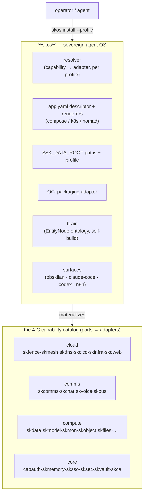
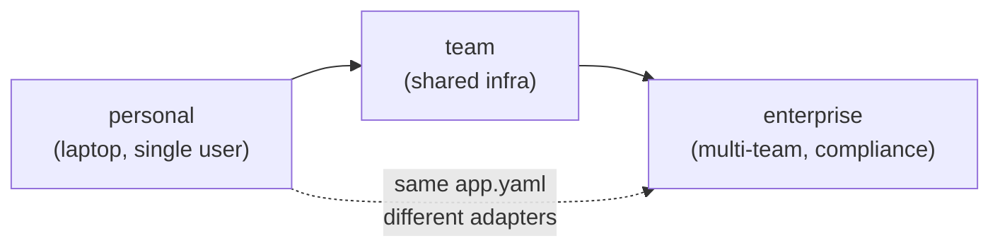

# skos — the Sovereign Agent OS 🐧

> **Your agents. Your infrastructure. Deploy anything, anywhere, own all of it.**
> One model — ports & adapters — from a laptop to a Kubernetes cluster, personal to
> enterprise, with zero lock-in.

skos is the **filesystem, packaging, and capability foundation** of the
[SKWorld](https://skworld.io) ecosystem. It gives every sovereign service one
consistent shape: a data-root abstraction (`$SK_DATA_ROOT`), an `app.yaml`
descriptor, an OCI packaging adapter, a profile resolver (personal → team →
enterprise), a **capability catalog** (the 4 C's: cloud / comms / compute / core),
and a self-building **brain** (an entity-graph knowledge ontology).

**The core idea:** every capability (`skdata`, `skmodel`, `skchat`, `capauth`, …) is
a **port**; every concrete tool (postgres, ollama, matrix, …) is a swappable
**adapter**. You declare *what* you want; skos resolves *how* for your profile.

## Quickstart

```bash
pip install -e .                         # into the ~/.skenv venv
skos setup                               # create the data-root tree + recommended personal capability set
skos capabilities                        # list the 4-C capability catalog
skos plan --profile personal             # show the resolved install plan (capability → adapter)
skos install --profile personal          # apply: data-root tree + record capabilities
skos path memory                         # print an abs path under $SK_DATA_ROOT
```

## Where it lives in SKStack v2

skos is the **substrate the whole stack stands on** — it defines the filesystem,
the descriptor, and the capability/adapter resolution that every other sk* service
is deployed through.



## What skos provides

| Piece | What it is |
|---|---|
| **`$SK_DATA_ROOT`** | one data-root abstraction; `skos path <subdir>` resolves it for the active profile |
| **`app.yaml` descriptor** | the universal service descriptor; `skos descriptor` validates it |
| **Capability catalog** | the 4 C's — every `sk*` port + its default & alternate adapters (`skos capabilities`) |
| **Resolver** | capability → adapter for a profile (`skos resolve <cap> --profile <p>`) |
| **Renderers** | descriptor → platform manifest (compose / k8s / nomad) (`skos render`) |
| **Packaging adapter** | OCI materialization (`skos materialize`) |
| **Profiles** | personal → team → enterprise; same model, different adapters |
| **Brain** | self-building entity-graph knowledge ontology (`skos brain init`, EntityNode schema) |
| **Surfaces** | runtime adapters (obsidian / claude-code / codex / n8n) that expose the brain (`skos surface …`) |
| **Unified GTD (`gtd-ingest`)** | one GTD, every input an adapter — email/ITIL/cron/calendar/telegram → one `capture()` sink; daily digests + `skos status`/`skos ingest` |

## Documentation

| Doc | Contents |
|---|---|
| **[Architecture](docs/ARCHITECTURE.md)** | ports/adapters model, the install flow, the brain, surfaces, where it lives (mermaids) |
| **[Capabilities](docs/CAPABILITIES.md)** | the full 4-C catalog — every port, default adapter, and alternates |
| **[Unified GTD — architecture](docs/gtd-ingest-architecture.md)** | the `gtd-ingest` spec: one port, pluggable sources, phased roadmap (mermaids) |
| **[Unified GTD — SOP](docs/gtd-ingest-SOP.md)** | build/test/deploy/config/API/troubleshoot for the GTD subsystem (crons, CLI, adapters) |
| **[Secret migration](docs/SECRET-MIGRATION.md)** | moving secrets into the skvault secret plane |

## Profiles (one model, every scale)



The descriptor never changes — only which adapter each capability resolves to. A
`skdata` port is a local Postgres on a laptop and a clustered one in production; you
don't rewrite anything to grow.

Part of the **[SKWorld](https://skworld.io)** sovereign ecosystem · site:
**[skos.skworld.io](https://skos.skworld.io)** · `curl -fsSL https://skos.skworld.io/install.sh | sh` · 🐧 smilinTux
