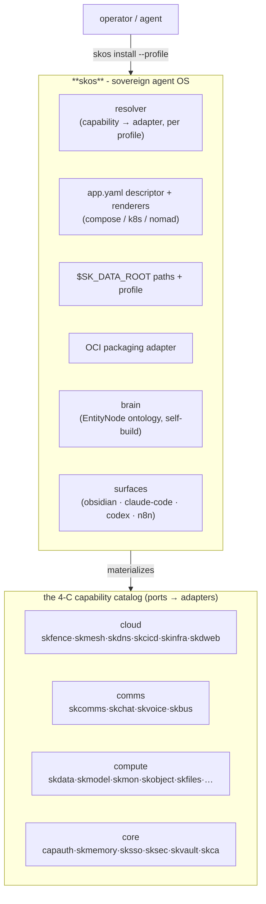
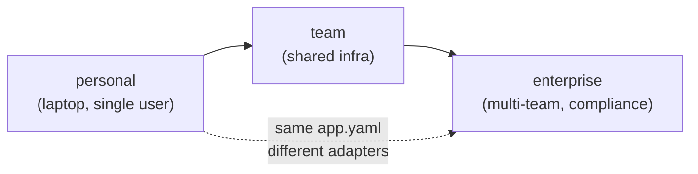

# skos: the Sovereign Agent OS 🐧

**Purpose:** the filesystem, packaging, and capability foundation every SKWorld service
is deployed through. A Python library + CLI (plus one optional read-only web surface).
`Status:` pre-1.0, active · `Maturity-tier:` **T0 (classical)**, symmetric-only, no
asymmetric key material · `License:` GPL-3.0-or-later · `SOP:` [SOP.md](SOP.md)

> **Your agents. Your infrastructure. Deploy anything, anywhere, own all of it.**
> One model (ports & adapters), from a laptop to a Kubernetes cluster, personal to
> enterprise, with zero lock-in.

> ⚠️ **Experimental, pre-1.0, and NOT independently security-audited.** skos holds one
> piece of key material: a local **symmetric** Fernet key (AES-128-CBC + HMAC-SHA256)
> that encrypts a single secret blob under `$SK_DATA_ROOT/secrets/`. There is no
> asymmetric crypto, no key exchange, and no network crypto here, and the `capauth`
> secret backend is a stub that raises. Read [SECURITY.md](SECURITY.md) before relying
> on it.

skos is the **filesystem, packaging, and capability foundation** of the
[SKWorld](https://skworld.io) ecosystem. It gives every sovereign service one
consistent shape: a data-root abstraction (`$SK_DATA_ROOT`), an `app.yaml`
descriptor, an OCI packaging adapter, a profile resolver (personal → team →
enterprise), a **capability catalog** (the 4 C's: cloud / comms / compute / core),
and a self-building **brain** (an entity-graph knowledge ontology).

**The core idea:** every capability (`skdata`, `skmodel`, `skchat`, `capauth`, …) is
a **port**; every concrete tool (postgres, ollama, matrix, …) is a swappable
**adapter**. You declare *what* you want; skos resolves *how* for your profile.

## Quickstart

```bash
pip install -e .                         # into the ~/.skenv venv
skos setup                               # create the data-root tree + recommended personal capability set
skos capabilities                        # list the 4-C capability catalog
skos plan --profile personal             # show the resolved install plan (capability → adapter)
skos install --profile personal          # apply: data-root tree + record capabilities
skos path memory                         # print an abs path under $SK_DATA_ROOT
```

## Where it lives in SKStack v2

skos is the **substrate the whole stack stands on**: it defines the filesystem,
the descriptor, and the capability/adapter resolution that every other sk* service
is deployed through.


```mermaid
flowchart TD
    OP["operator / agent"] -->|"skos install --profile"| SKOS
    subgraph SKOS["**skos** - sovereign agent OS"]
      RES["resolver<br/>(capability → adapter, per profile)"]
      DESC["app.yaml descriptor + renderers<br/>(compose / k8s / nomad)"]
      PATHS["$SK_DATA_ROOT paths + profile"]
      PKG["OCI packaging adapter"]
      BRAIN["brain<br/>(EntityNode ontology, self-build)"]
      SURF["surfaces<br/>(obsidian · claude-code · codex · n8n)"]
    end
    SKOS -->|materializes| CAPS
    subgraph CAPS["the 4-C capability catalog (ports → adapters)"]
      direction LR
      CLOUD["cloud<br/>skfence·skmesh·skdns·skcicd·skinfra·skdweb"]
      COMMS["comms<br/>skcomms·skchat·skvoice·skbus"]
      COMPUTE["compute<br/>skdata·skmodel·skmon·skobject·skfiles·…"]
      CORE["core<br/>capauth·skmemory·sksso·sksec·skvault·skca"]
    end
```

## What skos provides

| Piece | What it is |
|---|---|
| **`$SK_DATA_ROOT`** | one data-root abstraction; `skos path <subdir>` resolves it for the active profile |
| **`app.yaml` descriptor** | the universal service descriptor; `skos descriptor` validates it |
| **Capability catalog** | the 4 C's, every `sk*` port + its default & alternate adapters (`skos capabilities`) |
| **Resolver** | capability → adapter for a profile (`skos resolve <cap> --profile <p>`) |
| **Renderers** | descriptor → platform manifest (compose / k8s / nomad) (`skos render`) |
| **Packaging adapter** | OCI materialization (`skos materialize`) |
| **Profiles** | personal → team → enterprise; same model, different adapters |
| **Brain** | self-building entity-graph knowledge ontology (`skos brain init`, EntityNode schema) |
| **Surfaces** | runtime adapters (obsidian / claude-code / codex / n8n) that expose the brain (`skos surface …`) |
| **Unified GTD (`gtd-ingest`)** | one GTD, every input an adapter: email/ITIL/cron/calendar/telegram → one `capture()` sink; daily digests + `skos status`/`skos ingest` |
| **Capability packs (`skos install <pack>`)** | pluggable bolt-ons: one signed `skworld.module.json` (schema v1.2 `install` facet) activates a whole capability in one command, reversibly. First pack: **skbrain** (ITIL + CMDB + runbooks, all-or-nothing) |

## Capability packs (`skos install skbrain`)

A capability pack is a signed module manifest whose `install` facet declares an
ordered, typed, all-or-nothing install (schema v1.2). The skos planner
(`skos.packs.planner`, PURE) resolves the manifest into a validated, gated plan of
typed steps (sql_migration, db_roles, content_repo, seed, fleet_objects, doctor);
the provisioner (`skos.packs.provisioner`) executes it idempotently and fail-safe
through an injected side-effect boundary, records per-step state in
`registry/packs.json`, and emits the signed manifest into the shell/Atlas modules
dir.

```sh
skos install skbrain            # plan (gate on requires) + execute, all-or-nothing
skos install skbrain --dry-run  # show the ordered plan, touch nothing
skos status skbrain             # per-step health (a partial install reads UNHEALTHY)
skos remove skbrain             # reverse activation (fleet objects + manifest); --purge-db for the schema rollback
```

The installed pack exposes a thin private-knowledge CLI. Database credentials
are supplied only through the dedicated projector and reader DSNs; the reader
identity cannot write the `ops` namespace.

```bash
skbrain lint                     # redacted secret scan of git canon
skbrain sync                     # read-only projection plan, no embedding call
skbrain sync --commit            # atomic projector write + embeddings
skbrain search "telegram wedge"  # bounded hybrid retrieval as reader
skbrain doctor                   # content/schema/grant/projector health as JSON
skbrain operator observe --json  # fail-closed ATLAS observation contract
```

Coupling is by construction: there is no `--only` and no sub-selection. The
`sql_migration` and `db_roles` steps delegate to the shipped skmemory runners
(`skmemory pg migrate` / `skmemory pg roles`), so the ops DDL and the role SQL
live in exactly one place.

## Documentation

| Doc | Contents |
|---|---|
| **[SOP](SOP.md)** | the repo-level operational source of truth: build/test/release/config/API/troubleshooting, and the executable docs-evidence block |
| **[Security policy](SECURITY.md)** | honest crypto claims, threat model, supported versions, how to report a vulnerability |
| **[Contributing](CONTRIBUTING.md)** | branch model, commit trailer, the green-bar gate, and the traps specific to this repo |
| **[Architecture](docs/ARCHITECTURE.md)** | ports/adapters model, the install flow, the brain, surfaces, where it lives (mermaids) |
| **[Capabilities](docs/CAPABILITIES.md)** | the full 4-C catalog: every port, default adapter, and alternates |
| **[Unified GTD: architecture](docs/gtd-ingest-architecture.md)** | the `gtd-ingest` spec: one port, pluggable sources, phased roadmap (mermaids) |
| **[Unified GTD: SOP](docs/gtd-ingest-SOP.md)** | build/test/deploy/config/API/troubleshoot for the GTD subsystem (crons, CLI, adapters) |
| **[Autopilot: SOP](docs/skos-autopilot-SOP.md)** | the autocode engine: sandbox, harness registry, live-execution gate, kill switch, revert |
| **[Secret migration](docs/SECRET-MIGRATION.md)** | moving secrets into the skvault secret plane |

## Profiles (one model, every scale)


```mermaid
flowchart LR
    P["personal<br/>(laptop, single user)"] --> T["team<br/>(shared infra)"] --> E["enterprise<br/>(multi-team, compliance)"]
    P -.->|same app.yaml<br/>different adapters| E
```

The descriptor never changes: only which adapter each capability resolves to. A
`skdata` port is a local Postgres on a laptop and a clustered one in production; you
don't rewrite anything to grow.

## Standards conformance

- 📐 **Docs/SOP**, per [`SK_REPO_DOC_STANDARD`](https://github.com/smilinTux/sk-standards/blob/main/standards/SK_REPO_DOC_STANDARD.md): README-as-hub, 9-section SOPs, mermaid-first, cross-linked. The GTD subsystem ships an [architecture](docs/gtd-ingest-architecture.md) + [SOP](docs/gtd-ingest-SOP.md).
- 🔭 **Observability & Scheduling**, the `gtd-ingest` subsystem is the **reference implementation** of [`OBSERVABILITY_AND_SCHEDULING_STANDARD`](https://github.com/smilinTux/sk-standards/blob/main/standards/OBSERVABILITY_AND_SCHEDULING_STANDARD.md): every scheduled job wrapped (run-ledger + failure→GTD + `sk-alert`), inputs captured through one `source_ref`-deduped sink, daily ops report + on-demand `skos status`.
- 🧪 **Testing**, green-bar gate per [`TESTING_AND_CI_STANDARD`](https://github.com/smilinTux/sk-standards/blob/main/standards/TESTING_AND_CI_STANDARD.md).

## Related projects / See also

- ⬇️ **Used by:** [skcapstone](https://github.com/smilinTux/skcapstone), its ITIL ops are a push adapter on skos `gtd-ingest`; consumes the data-root + resolver.
- ↔️ **Siblings:** [skmemory](https://github.com/smilinTux/skmemory) (agent memory · a `skos` capability) · [skvault](https://github.com/smilinTux/skvault) (secrets plane · `skos.secrets`) · [SKStacks](https://github.com/smilinTux/SKStacks) (deploy fabric).
- 📐 **Standards:** [sk-standards](https://github.com/smilinTux/sk-standards): doc/SOP, architecture/dataflow, testing, **observability & scheduling**, version, backup.

Part of the **[SKWorld](https://skworld.io)** sovereign ecosystem · site:
**[skos.skworld.io](https://skos.skworld.io)** · `curl -fsSL https://skos.skworld.io/install.sh | sh` · 🐧 smilinTux
