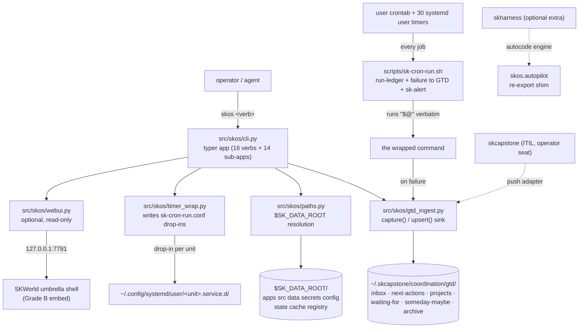

# skos - Standard Operating Procedures

skos is the sovereign agent OS: a Python **library plus CLI** that owns the data-root
filesystem, the `app.yaml` descriptor, the capability/adapter resolver, the unified GTD
capture sink, and the scheduler wrapping. It ships one **optional, read-only** HTTP
surface (`skos serve`). Callers are operators at a terminal, the systemd/cron schedule,
and sibling `sk*` packages that import `skos.paths` / `skos.gtd_ingest`.

> Two subsystems already have their own SOP and are **not** restated here. This document
> covers the repo as a whole and links out:
> - **[docs/gtd-ingest-SOP.md](docs/gtd-ingest-SOP.md)** - the unified GTD subsystem
>   (adapters, crons, digests, per-adapter troubleshooting).
> - **[docs/skos-autopilot-SOP.md](docs/skos-autopilot-SOP.md)** - the autopilot /
>   autocode engine (sandbox, harness registry, live-execution gate, kill switch).

---

## 1. Overview

**What skos owns**

| Area | What it is |
|---|---|
| Data root | `$SK_DATA_ROOT` resolution and the 8-subdir tree, `src/skos/paths.py`. Nothing else in the fleet joins data-root literals. |
| Descriptor + renderers | `app.yaml` validation and rendering to compose / k8s / nomad. |
| Capability catalog + resolver | the 4 C's (cloud / comms / compute / core), capability port to adapter per profile. |
| Capability packs | `skos install <pack>`: a signed `skworld.module.json` `install` facet, planned then provisioned all-or-nothing, state in `registry/packs.json`. |
| Unified GTD sink | `src/skos/gtd_ingest.py`, the single `capture()` / `upsert()` port every source adapter writes through. |
| Scheduler-as-code | `deploy/schedule/jobs.yaml` rendered into the user crontab by `skos schedule install`, every job wrapped in `scripts/sk-cron-run.sh`. |
| Timer wrapping | `src/skos/timer_wrap.py`, systemd drop-ins that route user timers through the same wrapper. |
| Secret plane adapter | `skos.secrets`, a `vault-file` Fernet backend plus a not-yet-implemented `capauth` backend. |
| Brain + surfaces | the entity-graph ontology and its obsidian / claude-code / codex / n8n adapters. |
| SKBrain ops plane | PostgreSQL + AGE canon projector, bounded read API, secret lint, doctor, and the signed capability pack under `src/skos/packs/skbrain/`. |
| Read-only web surface | `src/skos/webui.py`, optional extra `skos[web]`. |

**What skos explicitly does NOT do**

- **It does not own `skoperator`.** `~/.skenv/bin/skoperator` imports
  `skcapstone.operator_seat.cli:main`. `skoperator` is **not** in this repo's
  `[project.scripts]`, and `skoperator.service` runs **skcapstone** code that skos
  merely *wraps* in `sk-cron-run.sh`. See section 8 for why this matters.
- **It does not run a daemon.** There is no long-lived skos process. `skos serve` is
  opt-in, read-only, and loopback.
- **It does not store secret values in the tree.** `skos.secret_env` resolves names at
  runtime from the environment or a mode-600 file outside the repo.
- **It is not an identity or crypto root.** The only key material it touches is one
  local symmetric Fernet key (section 9, `SECURITY.md`).
- **It does not apply anything on import.** `deploy/` artifacts are inert until an
  explicit `skos schedule install` / `systemctl --user enable`.

## 2. Architecture



**Start here** (the five files that explain the repo):

| File | One-liner |
|---|---|
| `src/skos/cli.py` | The whole operator surface. Every `skos <verb>` and sub-app is registered here. |
| `src/skos/paths.py` | Single source of path truth: `data_root()` resolves `$SK_DATA_ROOT` or the active profile default; `TREE` is the 8 subdirs. |
| `src/skos/gtd_ingest.py` | The one GTD sink. `gtd_dir()` resolves the store; `capture()` and `upsert()` are the only write paths. |
| `src/skos/timer_wrap.py` | Generates the systemd `sk-cron-run.conf` drop-ins. Read `plan_wraps()` and its effective-vs-file ExecStart split before touching any timer (section 8). |
| `src/skos/webui.py` | The optional read-only web surface: bind defaults, the five GET routes, the fail-safe status snapshot. |

Deeper design docs: [docs/ARCHITECTURE.md](docs/ARCHITECTURE.md) (ports/adapters, install
flow, brain, surfaces), [docs/CAPABILITIES.md](docs/CAPABILITIES.md) (the full 4-C
catalog), [docs/gtd-ingest-architecture.md](docs/gtd-ingest-architecture.md).

## 3. Build

```bash
git clone https://github.com/smilinTux/skos && cd skos
pip install -e ".[dev]"          # base + test deps (this is what CI installs)
pip install -e ".[dev,web]"      # add fastapi + uvicorn for `skos serve`
pip install -e ".[dev,autopilot]"  # add skharness, the autocode engine
python -m build                  # wheel + sdist, hatchling backend
```

- Requires Python **>= 3.12**. CI builds on 3.12 and 3.13.
- `typer>=0.12,<0.13` and `click>=8.1,<8.2` are **both** hard-pinned. Unpinning either
  breaks the entire CLI at import. The reasons are in the `pyproject.toml` comments.
- The three extras are deliberately optional so a bare install resolves from PyPI alone
  and the CLI/scheduler never depend on a web stack or on `skharness`.

## 4. Test

The green-bar gate that blocks release is `.github/workflows/ci.yml`:

| Job | Command | Blocking |
|---|---|---|
| `test (py3.12)` / `test (py3.13)` | `pytest -q --cov=skos --cov-report=term-missing --cov-report=xml` | ✅ yes |
| `lint (ruff)` | `ruff check --select=E9,F63,F7,F82,F401 src tests` | ✅ yes |
| `lint (ruff)` | `ruff check src tests` and `ruff format --check src tests` | ❌ `continue-on-error`, advisory only |
| `build (wheel + sdist)` | `python -m build` then `twine check dist/*` | ✅ yes |
| `test (autopilot extra)` | `pytest -q --cov=skos` with `skharness` installed | ⚠️ see below |

Locally:

```bash
pytest -q                                   # 128 test modules under tests/
pytest -q tests/test_timer_wrap.py          # the drop-in generator
pytest -q tests/test_webui.py               # routes, read-only-ness, bind defaults
pytest -q tests/test_gtd_ingest.py tests/test_gtd_ingest_durability.py
```

⚠️ **`test (autopilot extra)` is a no-op GREEN when the `SKHARNESS_TOKEN` secret is
absent.** Its `Gate on skharness access` step sets `enabled=false`, every later step is
`if: enabled == 'true'`, and the job reports success having run zero tests. On a fork, or
any time the secret is not provisioned, a green check on that job certifies **nothing**.
The base `test` job still runs, but with the whole `skos.autopilot` tree ignored at
collection (`tests/conftest.py`). Read the job log for the
`autopilot tests skipped` notice before treating autopilot as covered.

**This is not theoretical.** On `origin/main` as of 2026-08-14, on a dev box with
`skharness` present, `pytest -q` reports **1 failed, 1141 passed, 1 skipped**. The
failure is `tests/test_autopilot_claude_code.py::test_argv_carries_skip_permissions_json_and_allowlist`,
inside exactly the tree CI never executes. Both CI jobs are green. Reproduce with
`pip install -e ".[dev,autopilot]" && pytest -q tests/test_autopilot_claude_code.py`.
Whether the cause is a skos defect or drift in the installed `skharness` is unresolved
(see "Unverified" below).

Two suites self-skip by design and their skips are expected, not failures:
`needs_skcapstone`-marked tests when skcapstone is absent, and every autopilot module
when `skharness` is absent.

## 5. Release / Deploy

skos is a library plus CLI, so "release" is publish, and "deploy" is installing the
scheduler artifacts on a node.

**Publish.** `.github/workflows/publish.yml` fires on a `v*` tag (or manual dispatch),
builds, runs `twine check`, and publishes to PyPI via Trusted Publishing (OIDC,
`owner=smilinTux workflow=publish.yml environment=pypi`). No PyPI token exists in the
path. **The test suite is deliberately not a gate on that workflow**: it gates on PRs in
`ci.yml` instead, so a tagged release only needs to build cleanly.

```bash
# bump the version in pyproject.toml, add the CHANGELOG entry, merge to main, then:
git tag -a vX.Y.Z -m "skos vX.Y.Z" && git push origin vX.Y.Z
```

⚠️ **Never push a tag from a feature branch.** The tag is the publish trigger. Verify the
artifact on PyPI, not the workflow's green check.

**Rollback (publish).** PyPI has no delete API you can rely on. Yank the release in the
PyPI UI and publish a fixed higher version. Never reuse a version number.

**Deploy the scheduler on a node.**

```bash
skos schedule list                # jobs declared in deploy/schedule/jobs.yaml
skos schedule render              # the crontab block that would be written (names, never secret values)
skos schedule diff                # render vs the live crontab
skos schedule install             # write it
```

Rollback is `crontab -` with the saved previous block. Full flow:
[docs/runbooks/skos-scheduler.md](docs/runbooks/skos-scheduler.md). The one systemd job,
`deploy/systemd/skos-backup.{service,timer}`, is inert in the repo and installed by
copying into `~/.config/systemd/user/` then `systemctl --user enable --now
skos-backup.timer`. Rollback: `systemctl --user disable --now skos-backup.timer`.

**Provision and verify SKBrain.** SKBrain is a capability pack, not a second
CMDB or ITIL authority. Install from a tagged GitHub checkout with the existing
`skmem-pg` PostgreSQL/AGE service available. The installer creates least-
privilege projector/reader roles and writes only the runtime variable names
`SKBRAIN_PG_PROJECTOR_DSN` and `SKBRAIN_PG_READER_DSN` to the owner-only
environment drop-in. It seeds KEDB content and projects canonical git content;
it deliberately does not invent a `cmdb seed` ownership path.

```bash
git pull --ff-only origin main
skos install skbrain                 # plan / dry-run
skos install skbrain --apply         # explicit mutation
skbrain lint                         # must return no findings
skbrain sync --commit                # transactional projector
skbrain doctor                       # schema, grants, content, lint, freshness
```

A committed projection refreshes observation time for unchanged canon nodes;
a dry run never does. The module may be registered with ATLAS only after its
canonical manifest bytes carry a trusted detached signature and one complete
observation reports every declared condition healthy. Missing DSNs, an absent
signature, or a failed doctor remain fail-closed. Roll back by restoring the
pre-install database dump recorded by the installer and the prior signed module
registry; do not delete canonical git content or CMDB/ITIL state.

**Rollback the timer wrapping.** Every wrap is a drop-in file, so undo is a delete:

```bash
rm ~/.config/systemd/user/<unit>.service.d/sk-cron-run.conf
systemctl --user daemon-reload
```

### Front-end / Exposure

- **Tier:** N/A. skos publishes **no** public ingress. It is not behind Funnel, Caddy,
  or Traefik.
- **Public `:443` routes:** none. This repo serves nothing on the public internet.
- **Bind address:** `127.0.0.1:7781`, loopback only, and only while `skos serve` is
  running. Defaults live in `src/skos/webui.py` (`DEFAULT_HOST` from `SKOS_WEB_HOST`,
  `DEFAULT_PORT` from `SKOS_WEB_PORT`); override with `--host` / `--port`. The module
  header states the rule: never a public wildcard by default.
- The surface is **read-only by construction**: only `GET` routes are registered, and
  `tests/test_webui.py::test_no_write_methods` and `::test_only_get_routes_are_registered`
  hold that line.

## 6. Configuration / Usage

| Setting | Source | Default |
|---|---|---|
| Data root | `$SK_DATA_ROOT`, else the active profile default | `paths.py:14-27`; unset with no profile raises `DataRootError` |
| Profile | `$SKOS_PROFILE` (`local` / `cluster` / `cloud`) | see `skos profile` |
| GTD store dir | `$SK_GTD_DIR` > skcapstone's `gtd_tools._gtd_dir` > `$SKCAPSTONE_HOME/coordination/gtd` | `~/.skcapstone/coordination/gtd` |
| Scheduler secrets | `$SKOS_SCHEDULE_ENV`, else `~/.skcapstone/skos-schedule.env` (mode 600, not in git) | template: `deploy/schedule/skos-schedule.env.example` |
| Scheduler manifest | `deploy/schedule/jobs.yaml` | paths written with `$HOME` / `$SKOS_REPO` so the file stays machine-independent |
| Web bind | `$SKOS_WEB_HOST` / `$SKOS_WEB_PORT`, or `--host` / `--port` | `127.0.0.1` / `7781` |
| Vault key | `$SKOS_VAULT_KEY`, else `$SK_DATA_ROOT/secrets/master.key` | auto-generated mode 0600 on first use |

**Secrets rule:** no real secret or PII value is committed. `skos.secret_env` resolves a
name from, in order, the process environment, then the gitignored operator env file, then
a caller-supplied placeholder. `skos schedule render` prints the variable **name**, never
the value. `skos secrets check` audits the resolution.

The GTD store is six JSON files: `inbox.json`, `next-actions.json`, `projects.json`,
`waiting-for.json`, `someday-maybe.json`, `archive.json`.

Common usage:

```bash
skos setup                      # create the data-root tree
skos path memory                # resolve an absolute path under $SK_DATA_ROOT
skos capabilities               # the 4-C catalog
skos plan --profile personal    # resolved install plan, changes nothing
skos status all                 # live self-report across every surface
skos status --json gtd
skos operator observe           # JSON conditions for the operator seat
skos serve --port 7781          # optional read-only pane (needs skos[web])
```

## 7. API / Reference

**Console entry points** (`pyproject.toml` `[project.scripts]`, the authoritative list):

| Command | Target |
|---|---|
| `skos` | `skos.cli:app` |
| `sk-status` | `skos.status:run` |
| `gtd-mail` | `skos.mail:main` |
| `skmodels` | `skos.models.cli:main` |

`skoperator` is **not** here. It belongs to skcapstone (section 1, section 8).

**CLI verbs.** Top level: `path`, `profile`, `describe`, `list`, `status`, `ingest`,
`store`, `install`, `remove`, `capabilities`, `resolve`, `render`, `init`, `plan`, `up`,
`serve`. Sub-apps: `gtd`, `placement`, `watchdog`, `secret`, `brain`, `surface`,
`autopilot`, `backup`, `revert-drill`, `schedule`, `coldstart`, `secrets`, `operator`,
`manifest`.

**Self-report.** These are how you check any claim in this document against the live box:

```
skos status [email|cron|gtd|docs|corpus|calendar|all|report|corpus-check] [--json]
skos status <pack>            # e.g. skbrain; a partial install exits non-zero
skos operator explain         # the operator-facet contract
skos operator observe         # live JSON: scheduler_alive, gtd_draining, quarantine_depth
skos autopilot doctor
skos coldstart check
skos secrets check
```

**The GTD sink** (`skos.gtd_ingest`), the two primitives every adapter uses:

| Function | Semantics |
|---|---|
| `capture(GtdCapture)` | create-or-**SKIP**. Deduped whole-store by `(source, source_ref)`. Safe to call repeatedly. |
| `upsert(GtdCapture)` | create-or-**UPDATE**. Returns an action in `{created, unchanged, updated, completed}` and performs **no write** on `unchanged`. |

A `GtdCapture` carries `text`, `source`, `source_ref` (the stable dedup key), `context`,
`priority`, `privacy`, `status`, `delegate_to`, `meta`. Adding a source is one adapter on
this port and no core change. Details: [docs/gtd-ingest-SOP.md](docs/gtd-ingest-SOP.md).

**HTTP routes** (`skos serve`, all `GET`, all read-only, `src/skos/webui.py`):

| Route | Returns |
|---|---|
| `GET /.well-known/skworld-module.json` | the SKWorld module manifest, URLs rebuilt origin-relative from the request |
| `GET /` and `GET /app` | the read-only Grade B status pane (HTML) |
| `GET /status.json` | the same snapshot, machine-readable |
| `GET /health` | `{"status","service","scheduler"}`; the manifest advertises this path |

FastAPI's `docs_url`, `redoc_url` and `openapi_url` are all disabled. No `POST`, `PUT`,
`PATCH` or `DELETE` route exists.

## 8. Troubleshooting

### ⚠️ The headline: a drop-in wrap once silently stripped flags from other drop-ins

**Fixed in code by card `47e32514`. The live drop-in state on a node is NOT fixed by
merging that card**, so read the whole of this section before touching a wrapped unit.

**What went wrong.** `timer_wrap._execstart_of()` read `ExecStart` out of the **base
`.service` file only** and never consulted the **effective**, post-drop-in `ExecStart`.
systemd's effective value is the base fragment plus its drop-ins applied in lexical
order, where a bare `ExecStart=` resets the list. So when skos wrapped
`skoperator.service`, it rebuilt the command from the base unit's report-only
`ExecStart=%h/.skenv/bin/skoperator run` and silently discarded `--execute` (contributed
by `execute.conf`) and `--honor`. Nothing errored. The seat quietly reverted to
report-only while every status surface looked healthy.

It **generalised**. `timer_wrap` wraps every wrappable systemd user timer on the node
(30 today), so **any** unit whose flags arrive from a drop-in rather than its base
fragment was exposed to the same silent strip.

`scripts/sk-cron-run.sh` is **innocent**. It runs `"$@"` verbatim (line 41). The stripping
was entirely `timer_wrap`'s reconstruction of the command.

**What the fix does.** `plan_wraps()` now asks systemd for the effective command,
`systemctl --user show <unit>.service -p ExecStartEx --value` (falling back to
`ExecStart`), and parses the `argv[]=` field of the last record. It falls back to the old
base-file read when systemctl is absent, the call fails or returns empty, the unit is a
bare template (`foo@.service`, which systemd refuses to resolve), or the record carries
an exec prefix the module will not reproduce blind (`+`, `!`, `@`). Each plan entry
reports which reading produced it in `exec_source` (`effective` or `file`). systemd is
consulted **only** when the target directory is one of systemd's own user unit
directories, so pointing `plan_wraps` at a fixture tree never reads the live manager.

Two consequences worth knowing. `systemctl show` reports an **already-expanded** command,
so a drop-in written from the effective value carries absolute paths where the file
fallback would have preserved `%h`. And because the wrap now snapshots the flags of every
other drop-in, **changing any contributing drop-in means re-running the wrap**, or
`sk-cron-run.conf` keeps replaying the old flags.

**Detect a stripped unit.** Compare the effective `ExecStart` against the base fragment:

```bash
systemctl --user show <unit>.service -p ExecStart --value      # effective
systemctl --user show <unit>.service -p FragmentPath --value   # the base file
systemctl --user show <unit>.service -p DropInPaths --value    # who else contributes
grep ExecStart "$(systemctl --user show <unit>.service -p FragmentPath --value)"
```

If a drop-in adds flags that the effective line does not carry, you have hit this bug.

**The live workaround** is a `zz-honor.conf` drop-in that sorts after `sk-cron-run.conf`
and restores the full command **through** the wrapper, so observability and the flags are
both in effect. On the primary node today:

```
ExecStart    = /home/cbrd21/clawd/skos/scripts/sk-cron-run.sh skoperator \
               /home/cbrd21/.skenv/bin/skoperator run --execute --honor
DropInPaths  = execute.conf  sk-cron-run.conf  zz-honor.conf
```

`zz-honor.conf` stays load-bearing until an operator has done the retirement below. Do
not delete it as cruft, and do not delete it merely because the code fix has merged.

**Retiring the workaround (operator, after the fix is deployed).** With the fix in place,
`skoperator`'s effective `ExecStart` is already the correctly wrapped command, so
`plan_wraps` reports it as needing nothing and will not rewrite the stale
`sk-cron-run.conf` underneath. Retiring `zz-honor.conf` therefore takes a deliberate
sequence, and every step is reversible by putting the file back:

1. Confirm the deployed `skos` actually contains the fix.
   `python -c "import skos.timer_wrap as t; print(hasattr(t,'parse_show_execstart'))"`
2. Move the flags onto a drop-in that sorts **before** `sk-cron-run.conf`, so the wrap
   can pick them up: add `--honor` to `execute.conf`'s `ExecStart` line (it already
   carries `--execute`, and `e` sorts before `s`).
3. Remove both the stale wrap and the workaround, then reload:
   `rm ~/.config/systemd/user/skoperator.service.d/{sk-cron-run.conf,zz-honor.conf}`
   then `systemctl --user daemon-reload`.
4. Verify the unwrapped effective command carries the flags:
   `systemctl --user show skoperator.service -p ExecStart --value` must end
   `skoperator run --execute --honor`.
5. Re-run the wrap so `sk-cron-run.conf` is regenerated from that effective command.
6. `systemctl --user daemon-reload`, then verify the final state: `ExecStart` runs
   through `sk-cron-run.sh` **and** ends `--execute --honor`, and `DropInPaths` no longer
   lists `zz-honor.conf`.

If step 4 or step 6 does not show both flags, restore `zz-honor.conf`, reload, and stop.

### Symptom to check table

| Symptom | Check |
|---|---|
| A wrapped unit silently lost its flags; behaviour reverted to the base unit's defaults | `systemctl --user show <unit> -p ExecStart --value` vs `grep ExecStart "$(systemctl --user show <unit> -p FragmentPath --value)"`. If a drop-in's flags are missing from the effective line, the node is running a `skos` from before card `47e32514`, or a `sk-cron-run.conf` written by one. Check the deployed code with `python -c "import skos.timer_wrap as t; print(hasattr(t,'parse_show_execstart'))"`, then follow the retirement sequence in section 8. Restore with a `zz-*.conf` drop-in that sorts last. |
| A wrapped unit runs the flags it had a month ago, not the ones its drop-ins set now | The wrap SNAPSHOTS the effective command into `sk-cron-run.conf`, which sorts after most drop-ins. Editing a contributing drop-in does not update it. Re-run the wrap after changing any drop-in that contributes flags. |
| A drop-in wrote absolute paths where the unit used `%h` | Expected. `systemctl show` reports an already-expanded command, so an entry with `exec_source: effective` cannot carry specifiers. Only the base-file fallback (`exec_source: file`, which is what a bare `foo@.service` template gets) preserves `%h`. |
| `skoperator` behaves differently after a `git checkout` or an uncommitted edit in `~/clawd/skos` | `skoperator.service` runs `/home/cbrd21/clawd/skos/scripts/sk-cron-run.sh`, a path inside the **working checkout**, not an installed copy. Any edit or revert there changes production immediately. `git -C ~/clawd/skos status` and `git -C ~/clawd/skos log -1 -- scripts/sk-cron-run.sh`. |
| A wrapped job runs **twice** per trigger | The drop-in is missing its bare `ExecStart=` reset. `ExecStart` is list-typed, so systemd appends. `grep -c '^ExecStart' <unit>.service.d/sk-cron-run.conf` must show 2 lines, the first empty. |
| `skos --help` dies with `Choice is not subscriptable` or `Secondary flag is not valid for non-boolean flag` | The typer/click pins were bypassed. `pip show typer click`; require `typer>=0.12,<0.13` and `click>=8.1,<8.2`. Both pins are needed, not either one. |
| `pip show skos` and `pip show skos-sovereign` disagree, or a version looks stale | The distribution was renamed to `skos-sovereign`; an older editable install still registers as `skos`. Do not trust an installed version string as authoritative. Read `pyproject.toml` on the ref you care about, and confirm releases on PyPI. |
| `skos serve` exits with an import error | The web extra is not installed. `pip install -e ".[web]"`. FastAPI and uvicorn are imported lazily inside `build_app()`, so importing `skos.webui` without them succeeds and only serving fails. |
| Nothing is listening on 7781 | `skos serve` is not running. There is **no** skos daemon; the surface is opt-in. `ss -ltnp | grep 7781`. |
| `DataRootError: SK_DATA_ROOT is unset and no profile default applies` | Set `SK_DATA_ROOT`, or set `SKOS_PROFILE` to `local`, `cluster` or `cloud`. `skos profile` shows the active one. |
| GTD writes land somewhere unexpected | Resolution is `SK_GTD_DIR` > skcapstone's `_gtd_dir()` > `$SKCAPSTONE_HOME/coordination/gtd`. A skcapstone present on the path wins over the `SKCAPSTONE_HOME` fallback. `python -c "from skos.gtd_ingest import gtd_dir; print(gtd_dir())"`. |
| A source adapter keeps re-creating the same item | It is calling `capture()` (create-or-skip) with an unstable `source_ref`, or it wants `upsert()`. The dedup key is `(source, source_ref)` and nothing else. |
| A scheduled job failed and nobody was told | The job is not going through `scripts/sk-cron-run.sh`. `skos status cron` reads the ledger at `~/.skcapstone/logs/cron-ledger.jsonl`; `skos schedule diff` shows render vs live crontab. |
| CI is green but autopilot changes were never tested | The `test (autopilot extra)` job no-ops green without `SKHARNESS_TOKEN`. Open the job log and look for the `autopilot tests skipped` notice. Section 4. |
| `vault-file decrypt failed (wrong SKOS_VAULT_KEY?)` | `$SKOS_VAULT_KEY` is set to a key that did not encrypt the blob, or `$SK_DATA_ROOT` moved. Unset the env var to fall back to `$SK_DATA_ROOT/secrets/master.key`. |
| `capauth secret backend not yet implemented` | Expected. `skos.secrets.capauth` is a stub that raises. Use the default `vault-file` backend. |

## 9. Maturity-tier + Version reference

**Crypto maturity tier: T0 (classical), narrow scope.** skos is a **modest** crypto
component, not a crypto library:

- The only key material it handles is one **symmetric** Fernet key, generated by
  `src/skos/secrets/vault_file.py` at `$SK_DATA_ROOT/secrets/master.key`, `chmod 0600`,
  and used to encrypt one local JSON blob (`secrets/vault-file.enc`).
- Fernet is **AES-128-CBC with HMAC-SHA256**, from `cryptography`. It is symmetric only.
- There is **no asymmetric key material, no key exchange, no signing, and no network
  crypto** in this repo. T1 (agility), T2 (hybrid KEM) and T3 (hybrid signature) do not
  apply because there is no negotiated surface to apply them to.
- `src/skos/secrets/capauth.py` is a **stub that raises**. skos does not implement
  sovereign PGP storage; that lives in capauth.
- Honest-claim posture and the experimental/unaudited statement: see
  [SECURITY.md](SECURITY.md).

**Version.** Do **not** quote a version from this document. The distribution is
`skos-sovereign` (the import package stays `skos`); the version is declared in
`pyproject.toml` on the ref you are looking at, and published releases are on PyPI. An
installed environment may still carry an older editable install registered under the
pre-rename name `skos`, so `pip show` is not authoritative for this repo.

**Lifecycle.** Pre-1.0, `0.x`. Per
[VERSION_LIFECYCLE](https://github.com/smilinTux/sk-standards/blob/main/standards/VERSION_LIFECYCLE.md),
only the latest published `0.x` line gets fixes.

**Standards conformance.**
[SK_REPO_DOC_STANDARD](https://github.com/smilinTux/sk-standards/blob/main/standards/SK_REPO_DOC_STANDARD.md)
(this document and the docs-evidence block below),
[OBSERVABILITY_AND_SCHEDULING_STANDARD](https://github.com/smilinTux/sk-standards/blob/main/standards/OBSERVABILITY_AND_SCHEDULING_STANDARD.md)
(the `gtd-ingest` subsystem is the fleet reference implementation, with the timer-wrap
caveat in section 8 as a known live defect),
[TESTING_AND_CI_STANDARD](https://github.com/smilinTux/sk-standards/blob/main/standards/TESTING_AND_CI_STANDARD.md),
[SECURITY_DISCLOSURE_STANDARD](https://github.com/smilinTux/sk-standards/blob/main/standards/SECURITY_DISCLOSURE_STANDARD.md).

**License.** GPL-3.0-or-later, fleet decision 2026-08-14. See [LICENSE](LICENSE).

---

## Unverified / needs an operator pass

Honest gaps. Do not treat these as documented:

- **Multi-node scope.** Every live observation in section 8 was made on the primary node
  (`noroc2027` / `.158`). Whether other fleet nodes carry the same drop-in set, or the
  same `zz-honor.conf` workaround, has not been checked.
- **The timer-wrap blast radius is measured, not enumerated.** 30 user timers carry a
  `sk-cron-run.conf` drop-in on the primary node. Which of those 30 additionally take
  flags from a drop-in (and are therefore actively mis-wrapped rather than merely
  exposed) has not been audited unit by unit. `skoperator` is the one confirmed case.
- **Rollback of a published release** is described from the PyPI policy, not from a drill
  performed on this package.
- **`skos install <pack>` reversal.** `skos remove <pack>` and `--purge-db` are documented
  from the CLI and README; no restore drill was run as part of this pass. The revert drill
  that *is* exercised is `skos revert-drill run`
  ([docs/runbooks/revert-drill.md](docs/runbooks/revert-drill.md)).
- **Coverage numbers.** CI collects coverage but enforces no threshold, so no coverage
  claim is made here.
- **The failing autopilot test in section 4 is unattributed.**
  `test_argv_carries_skip_permissions_json_and_allowlist` fails on this box, where
  `skharness` is an editable checkout rather than the PyPI release. Whether the defect is
  in skos, in `skos.autopilot`'s re-export shim, or in the locally checked-out
  `skharness`, has not been isolated. It is recorded because a red test hidden behind a
  green gate must be written down, not because the root cause is known.

## Related docs / See also

- 📐 **Architecture:** [docs/ARCHITECTURE.md](docs/ARCHITECTURE.md) ·
  [docs/CAPABILITIES.md](docs/CAPABILITIES.md)
- 📋 **Subsystem SOPs:** [gtd-ingest](docs/gtd-ingest-SOP.md) ·
  [autopilot](docs/skos-autopilot-SOP.md)
- 📕 **Runbooks:** [scheduler](docs/runbooks/skos-scheduler.md) ·
  [cold start](docs/runbooks/skos-coldstart.md) ·
  [backup/restore](docs/runbooks/skbackup-restore.md) ·
  [revert drill](docs/runbooks/revert-drill.md) ·
  [manifest](docs/runbooks/skos-manifest.md) ·
  [secret provisioning](docs/runbooks/skos-secret-provisioning.md)
- 🔐 **Security:** [SECURITY.md](SECURITY.md) ·
  [docs/SECRET-MIGRATION.md](docs/SECRET-MIGRATION.md)
- 🤝 **Contributing:** [CONTRIBUTING.md](CONTRIBUTING.md) ·
  [CODE_OF_CONDUCT.md](CODE_OF_CONDUCT.md)

<!-- docs-evidence
verified: 2026-08-14
checks:
  - name: the four console entry points are exactly what section 7 documents
    run: grep -qF 'skos = "skos.cli:app"' pyproject.toml && grep -qF 'sk-status = "skos.status:run"' pyproject.toml && grep -qF 'gtd-mail = "skos.mail:main"' pyproject.toml && grep -qF 'skmodels = "skos.models.cli:main"' pyproject.toml
  - name: skoperator is NOT a skos entry point
    run: ! grep -q 'skoperator' pyproject.toml
  - name: the web surface still binds loopback 127.0.0.1:7781 by default
    run: grep -qF 'os.environ.get("SKOS_WEB_HOST", "127.0.0.1")' src/skos/webui.py && grep -qF 'os.environ.get("SKOS_WEB_PORT", "7781")' src/skos/webui.py
  - name: the documented GET routes exist and no write route was added
    run: grep -qF '@app.get("/.well-known/skworld-module.json")' src/skos/webui.py && grep -qF '@app.get("/status.json")' src/skos/webui.py && grep -qF '@app.get("/health")' src/skos/webui.py && ! grep -qE '@app\.(post|put|patch|delete)' src/skos/webui.py
  - name: the GTD store path precedence and the six list files are unchanged
    run: grep -qF 'SK_GTD_DIR' src/skos/gtd_ingest.py && grep -qF 'home / "coordination" / "gtd"' src/skos/gtd_ingest.py && test "$(tr -d ' \n' < src/skos/gtd_ingest.py | grep -o '_ALL_FILES=\[[^]]*\]')" = '_ALL_FILES=["inbox.json","next-actions.json","projects.json","waiting-for.json","someday-maybe.json","archive.json"]'
  - name: timer_wrap reads the EFFECTIVE ExecStart, with the base file only as fallback
    run: grep -qF 'DROPIN_NAME = "sk-cron-run.conf"' src/skos/timer_wrap.py && grep -qF 'execstart = effective_execstart(f"{unit}.service", query)' src/skos/timer_wrap.py && grep -qF 'def parse_show_execstart' src/skos/timer_wrap.py && grep -qF 'execstart = _execstart_of(service)' src/skos/timer_wrap.py
  - name: sk-cron-run.sh still runs its argv verbatim (it is not the stripper)
    run: grep -qF 'out="$("$@" 2>&1)"' scripts/sk-cron-run.sh
  - name: the blocking ruff gate is exactly the rule set section 4 documents
    run: grep -qF 'ruff check --select=E9,F63,F7,F82,F401 src tests' .github/workflows/ci.yml
  - name: the scheduler secret file and manifest paths section 6 documents exist
    run: grep -qF 'skos-schedule.env' src/skos/secret_env.py && test -f deploy/schedule/skos-schedule.env.example && test -f deploy/schedule/jobs.yaml
  - name: the vault-file key is symmetric Fernet at mode 0600 (section 9 tier claim)
    run: grep -qF 'Fernet.generate_key()' src/skos/secrets/vault_file.py && grep -qF 'keyfile.chmod(0o600)' src/skos/secrets/vault_file.py && grep -qF 'not yet implemented' src/skos/secrets/capauth.py
-->
