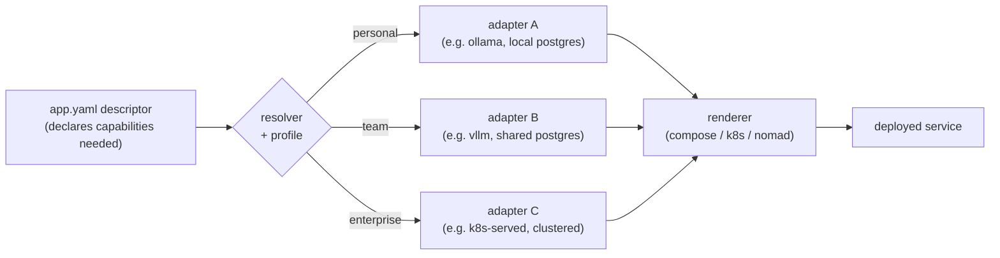
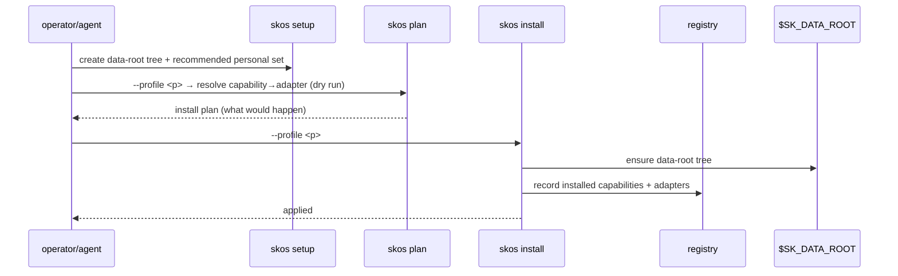
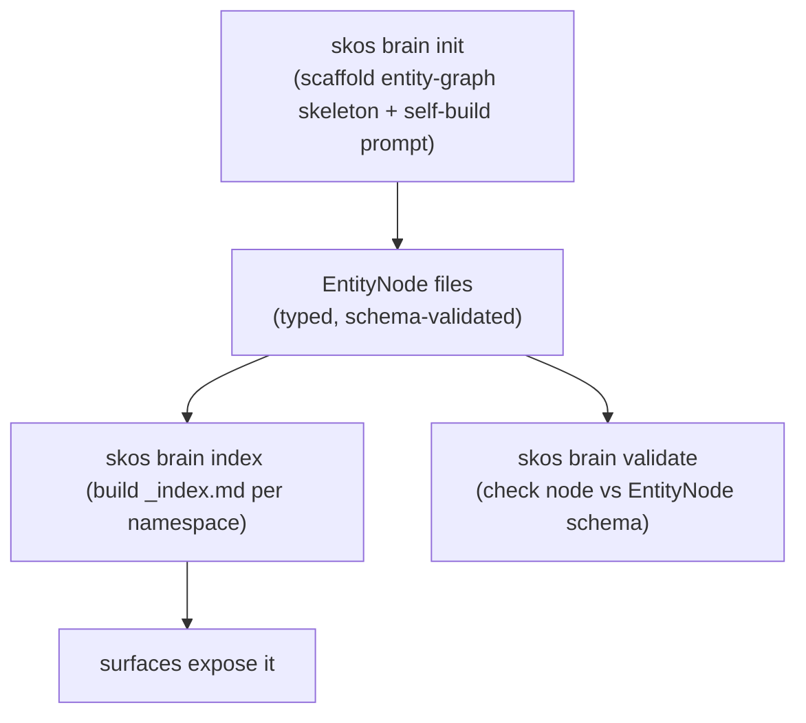
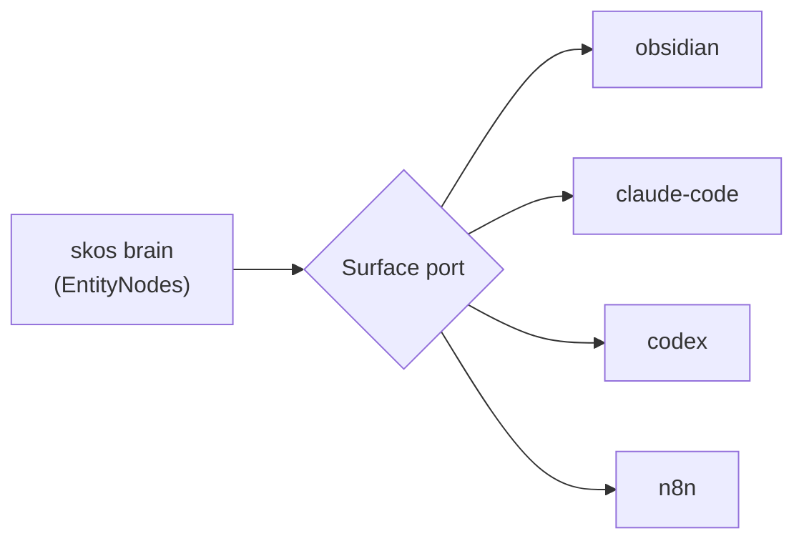
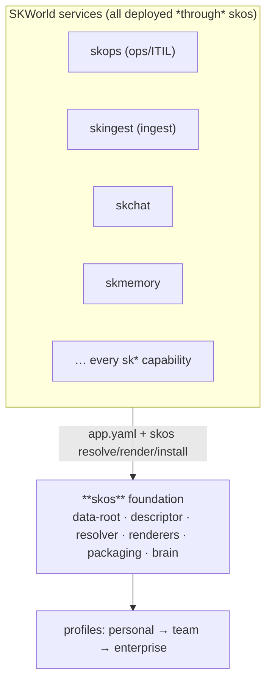

# skos Architecture

skos is a **ports & adapters** foundation: capabilities are ports, concrete tools
are adapters, and a profile decides which adapter each port resolves to. Everything
else — the data-root, the descriptor, the renderers, the brain, the surfaces — exists
to make "declare what, resolve how" work from a laptop to a cluster.

## The ports/adapters model

You write one `app.yaml`. The resolver maps each declared capability to a concrete
adapter for your profile; the renderer turns the result into a platform manifest.
Swap a profile, get a different deployment — same descriptor.

## The install flow

CLI surface: `skos {path, profile, descriptor, list, materialize, capabilities,
resolve, render, setup, plan, install}` plus the brain/surface commands below.

## The data-root abstraction

Every service reads and writes under **`$SK_DATA_ROOT`**, resolved per profile.
`skos path <subdir>` prints the absolute path — so code never hardcodes locations
and the same app works whether the root is `~/.skdata` on a laptop or a mounted
volume in a cluster.

## The brain (self-building knowledge ontology)

skos carries an **entity-graph brain**: an `EntityNode` ontology that a wiki/graph
self-builds and validates.

## Surfaces (runtime adapters)

The brain is exposed through **surfaces** — runtime adapters that map skos entities
into a host environment (Obsidian, Claude Code, Codex, n8n).

`skos surface {resolve, list, entities, show}` — list registered surfaces, see what
entities they expose, and render an entity node as markdown for that surface.

## Where skos sits under everything else

skos is the **#1 sub-project** of the v2 build sequence — the filesystem & packaging
foundation the rest of the stack is built on (design specs:
`2026-06-09-skos-{filesystem-packaging-foundation,capability-map,brain-architecture}.md`).
