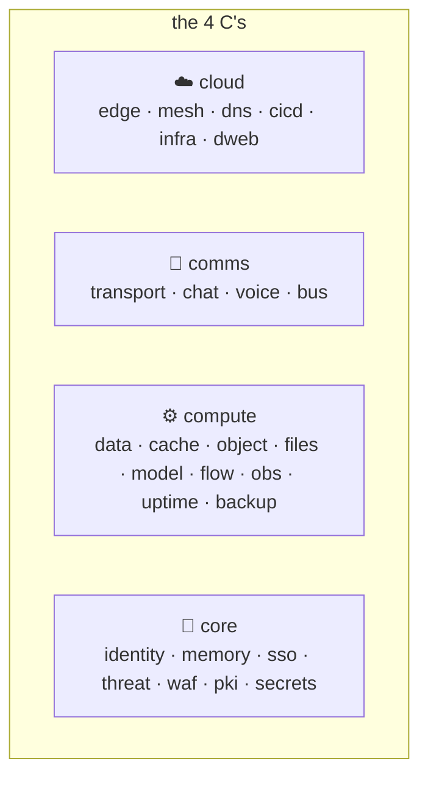

# skos Capability Catalog — the 4 C's

Every sovereign capability is a **port** (a stable `sk*` name + interface); every
concrete tool is a swappable **adapter**. The catalog groups ports into four
families — **cloud · comms · compute · core** — each with a sensible default adapter
and best-of-breed alternates. Source of truth: `src/skos/capabilities.yaml`
(`skos capabilities` prints it live).



## ☁️ Cloud

| Port | Purpose | Default | Alternates |
|---|---|---|---|
| `skfence` | Edge / ingress / reverse proxy | traefik | caddy, envoy-gateway |
| `skmesh` | Overlay mesh / tunnels | netbird | headscale, tailscale, pangolin, cloudflared |
| `skdns` | DNS authoritative + resolver/filter | powerdns | adguard-home, cloudflare |
| `skcicd` | CI/CD | argocd | ansible, flux |
| `skinfra` | Infra provisioning | opentofu | terraform, pulumi |
| `skdweb` | Decentralized availability + naming | ipfs | ipfs-cluster, ens, handshake |

## 📡 Comms

| Port | Purpose | Default | Alternates |
|---|---|---|---|
| `skcomms` | Multi-channel transport | skcomms | — |
| `skchat` | Chat / federation | matrix | xmpp, nostr |
| `skvoice` | Voice / video RTC | livekit | mediasoup, janus |
| `skbus` | Machine A2A event bus | nats | redpanda |

## ⚙️ Compute

| Port | Purpose | Default | Alternates |
|---|---|---|---|
| `skdata` | Relational + vector + graph + search | postgres | arcadedb |
| `skcache` | Cache / KV | valkey | dragonflydb |
| `skobject` | Object / S3 | garage | seaweedfs |
| `skfiles` | Files / sync | nextcloud | seafile, syncthing |
| `skmodel` | LLM / inference serving | ollama | vllm, llama-cpp |
| `skflow` | Automation / workflow | n8n | windmill, temporal |
| `skmon` | Observability (metrics/logs/traces) | grafana-stack | signoz |
| `skpulse` | Uptime / status | uptime-kuma | — |
| `skbackup` | Backup | restic | kopia, borg |

## 🔐 Core

| Port | Purpose | Default | Alternates |
|---|---|---|---|
| `capauth` | Sovereign PGP identity | capauth | — |
| `skmemory` | Sovereign agent memory | skmemory | — |
| `sksso` | Identity / SSO | authentik | zitadel |
| `sksec` | Threat defense | crowdsec | falco, wazuh, suricata |
| `skwaf` | Web app firewall | coraza | bunkerweb |
| `skca` | Internal PKI / mTLS | step-ca | — |
| `skvault` | Secret resolution | vault-file | capauth, hashicorp-vault |

## Resolving a capability

```bash
skos capabilities                         # list the whole catalog (grouped by C)
skos resolve skmodel --profile personal   # → ollama
skos resolve skmodel --profile enterprise # → vllm (example)
skos resolve skdata --adapter arcadedb    # override the default explicitly
```

The point: an app declares `skmodel` (it needs inference), not `ollama`. Whether that
resolves to ollama on a laptop or vLLM in a cluster is a **profile + adapter**
decision skos makes — the app is portable across all of them. Adding a new backend
means writing one adapter; nothing that declares the port changes.
