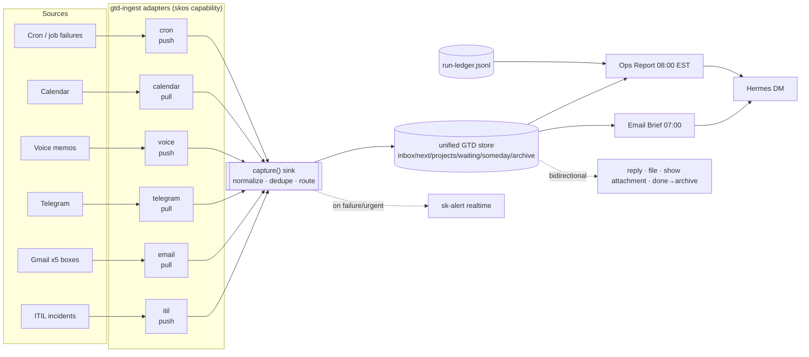
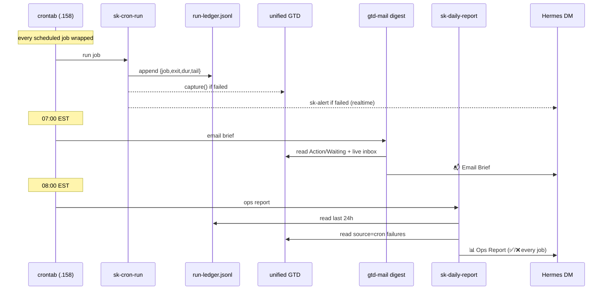

# skos GTD-Ingest: Unified GTD as a Port, Every Source an Adapter

**Status:** design (2026-07-03) · **Owner:** Lumina + Chef · **Epic:** (coord)
**Operational SOP:** [`gtd-ingest-SOP.md`](./gtd-ingest-SOP.md) (build/test/deploy/config/API/troubleshoot).
**Goal:** skos is Chef's ONE unified GTD for all work in this realm. Every input,
from ITIL incidents, email across N mailboxes, Telegram, voice, calendar, and cron
failures, is captured into a single GTD store through **one port with pluggable
adapters**. Notifications (daily email brief, daily ops report) and bidirectional
actions (reply, file, show attachment, mark done→archive) sit on top.

The north star: *adding a new source is writing one adapter: no core changes.*

---

## 1. Principles

1. **One inbox, many sources.** All captures land in the same store
   (`$SK_DATA_ROOT/coordination/gtd/*.json`) with a `source` tag. Clarify once,
   organize everywhere. (This is already the GTD data model, see §3.)
2. **Ports & adapters (skos idiom).** A single capability **`gtd-ingest`** is the
   port. `itil`, `email`, `telegram`, `voice`, `calendar`, `cron` are adapters.
   Resolver picks which are active per profile (personal/team/enterprise).
3. **Two adapter styles, one sink.** *Push* adapters emit on events (ITIL incident
   created). *Pull* adapters are polled by a scheduled job (email). Both call the
   **same `capture()` sink**, which normalizes + dedupes + writes the store.
4. **Idempotent + deduped.** Every capture carries a stable `source_ref`
   (incident id, gmail thread id, message-id). Re-ingest never duplicates.
5. **Observable by default.** Every scheduled job runs under `sk-cron-run`, which
   writes a run-ledger record and, on failure, captures a GTD item + fires
   sk-alert. Nothing fails silently.
6. **Notify, don't nag.** Real-time sk-alert only on failure/urgent; the rest is
   rolled into two scheduled digests (email brief 07:00, ops report 08:00 EST).
7. **Sovereign + scalable.** Store is plain JSON, Syncthing-synced across nodes,
   privacy-tagged (private/team/community/public), delegable to agents.

---

## 2. The framework at a glance



---

## 3. The store & data model (already exists: reuse, don't reinvent)

Unified store: `$SK_DATA_ROOT/coordination/gtd/` → `inbox.json`,
`next-actions.json`, `projects.json`, `waiting-for.json`, `someday-maybe.json`,
`archive.json`. Syncthing-synced. Item schema:

```jsonc
{
  "id": "12-hex",
  "text": "human summary",
  "source": "itil | email | telegram | voice | calendar | cron | manual",
  "source_ref": "inc-b4daebb9 | <gmail-thread-id> | ...",   // NEW: dedup key
  "privacy": "private | team | community | public",
  "context": "@ops | @email | @phone | @home | ...",
  "priority": "critical | high | medium | low | null",
  "energy": "high | medium | low | null",
  "status": "inbox | next | project | waiting | someday | reference | done",
  "delegate_to": "agent | null",
  "created_at": "iso8601", "clarified_at": "...", "completed_at": "...",
  // source-specific metadata namespaced by source, e.g.:
  "email_account": "...", "email_from": "...", "email_subject": "...",
  "email_thread_id": "...", "attachments": [ ... ]
}
```

Only **one additive change** to the model: promote `source_ref` to a first-class
field so the sink can dedupe uniformly across sources (today ITIL embeds the id
in `text`; email uses `email_thread_id`).

---

## 4. The port: `gtd-ingest` capability + adapter contract

Declared in `skos/src/skos/capabilities.yaml`:

```yaml
gtd-ingest:
  group: core
  default: itil            # always-on
  alternates: [email, telegram, voice, calendar, cron]
  profiles:
    personal: {enable: [itil, email, cron]}
    team:     {enable: [itil, email, cron, telegram]}
```

Adapter base (in `skos`), each source subclasses it:

```python
@dataclass
class GtdCapture:
    text: str
    source: str
    source_ref: str            # stable dedup key
    context: str = "@inbox"
    priority: str | None = None
    privacy: str = "private"
    status: str = "inbox"      # or pre-clarified: next / waiting / ...
    delegate_to: str | None = None
    meta: dict = field(default_factory=dict)   # source-specific fields

class GtdSourceAdapter(Adapter):
    capability = "gtd-ingest"
    name: str                  # "email", "itil", ...
    def poll(self) -> list[GtdCapture]:  # PULL adapters implement this
        return []
    # PUSH adapters simply call sink.capture(GtdCapture(...)) on their events.

def capture(c: GtdCapture) -> str | None:
    """The single sink. Dedupe by (source, source_ref); normalize; write store;
    return item id or None if duplicate. Emits sk-alert if priority in {crit}."""
```

- **Pull** adapters (`email`, `telegram`, `calendar`) are driven by a scheduler
  job that calls `poll()` then `capture()` for each result.
- **Push** adapters (`itil`, `cron`, `voice`) call `capture()` directly on events.

*Adding a source = implement `poll()` (or call `capture()`), register the class,
add a line to `capabilities.yaml`, and (for pull) drop a job yaml. Nothing else.*

---

## 5. First three adapters

### 5a. `itil` (push): refactor of what already exists
`itil_tools.itil_incident_create()` today hardcodes a GTD write. Refactor to build
a `GtdCapture(source="itil", source_ref=inc_id, context="@ops", priority=<sev-map>)`
and call `capture()`. Same behavior, now behind the port. This is the reference
adapter and the proof the framework fits existing code.

### 5b. `email` (pull): the multi-box mail adapter
- Backed by `gog` (5 Gmail accounts today; the adapter interface is mailbox-agnostic
  so IMAP/Outlook are future adapters or backends).
- **Noise sweep** (promotions/social/updates/forums → `3 Read` + archive) stays a
  cheap deterministic pass (already the daily `gtd-triage.sh`).
- **Intelligent triage** of primary mail → Gmail GTD labels (`1 Action`/`2 Waiting`/
  `3 Read`/`4 Someday`/`Areas/*`). Phase-0: agent-run (like this session). Phase-2:
  scheduled agent job + local-LLM classifier for the bulk.
- **Capture:** `poll()` reads `label:"1 Action"` and `label:"2 Waiting"` threads and
  emits `GtdCapture(source="email", source_ref=<thread-id>, status=next|waiting)` →
  the unified GTD. Deduped by thread id. (Implemented Phase-0 in
  `skos/mail.py (`gtd-mail` console script) capture`.)
- **Bidirectional (DONE 2026-07-03):** act on GTD email items via `gtd-mail`:
  - `reply <ref> --body …`: reply in-thread; default a reviewable Gmail **DRAFT**
    (outbound email is consequential, safe by default), `--send` to send.
  - `done <gtd_id>`: mark the GTD item done **and** archive+mark-read the email
    thread (closes the loop both ways).
  - `attachments <ref> --telegram`: list + download a thread's attachments and
    deliver each to Chef's Telegram DM ("show attachment").
  `<ref>` resolves a GTD item id → (account, thread, messages, attachments), so
  Chef/agent can act by GTD id or raw thread id. Reversible: archive re-adds INBOX.

### 5c. `cron` (push): the observability adapter
`sk-cron-run <job> <cmd…>` wraps every scheduled job:
1. append a **run-ledger** record (JSONL): `{job, host, start, end, dur_s, exit, ok, tail}`.
2. on failure → `capture(GtdCapture(source="cron", source_ref="<job>@<date>",
   context="@ops", priority="high", text="cron FAILED: <job> - <err>"))` **and** sk-alert.
This makes cron/scheduled-work health a first-class GTD + alert citizen and feeds
the daily ops report.

---

## 6. Reporting layer (the two daily digests)



**Email Brief (07:00 EST):** `gtd-mail.py digest`: Action → Waiting → new-today →
inbox health, across all boxes, sorted by what Chef acts on. *(built)*

**Ops / Work Report (08:00 EST):** `sk-daily-report.py`: for the last 24h, every
scheduled job's success/failure/duration from the run-ledger + skscheduler status +
any GTD `source=cron` failures. ✅ green summary or ❌ with the error tail. Always
sent (so "silence" is never ambiguous); sk-alert escalates if any failure. *(build)*

---

## 6b. Context sources (read-only): "what have I been working on"

Not every source *captures* GTD items. Some provide **read-only context** that
enriches the digests. First one: **recent docs**, the latest documents Chef
worked on, newest-first, surfaced in the Ops Report and on demand via
`sk-status docs`. Same adapter shape (a `poll()`-style provider), but its output
is rendered, not written to the store.

- **Google Drive** (all 5 accounts): `gog drive ls --all` → docs/sheets/slides/
  pdf/office (media filtered out), sorted by `modifiedTime`, deduped by name.
- **Nextcloud dkloud `p/` + `r/`** (projects/reference): filesystem mtime walk.
  **Offline during the current outage; auto-included the moment `~/dkloud.douno.it`
  reappears (~Aug 2026), a path check, zero code change.** Extra roots via
  `GTD_DOC_DIRS`.
- Future context sources fit the same slot: calendar (today's events), git (repos
  touched today), skmemory (recent memories).

## 6c. Monitored-pipeline sources (health + maintenance-ensure)

Some sources aren't just captured/reported: they own a *pipeline* skos must keep
healthy. First one: **corpus / realmwiki**. It (a) reports health, (b) flags
triage, (c) ensures its maintenance jobs run, all through the same ledger +
report + capture machinery.

- **Health/triage** (`sk-status corpus`, Ops Report): realmwiki page count +
  dangling-link / orphan / stub / **unverified** (Lumina's research queue) counts
  via `wiki/tools/wiki_maintain.py scan`; uncommitted-pages + last-commit age;
  the **YouTube/corpus ingest** last-run result (`ok/fail/skip`, hours-ago) parsed
  from its log; **skmem-pg `docs`** corpus size. A `⚠️ triage` flag trips when the
  research queue or dangling backlog crosses a threshold.
- **Maintenance-ensure**: `wiki-maintain` cron runs `wiki_maintain.py fill`
  (qwen drafts grounded stubs for the top dangling links) daily, and the
  **youtube-ingest** job is now wrapped in `sk-cron-run`, both land in the
  run-ledger, so a miss/failure becomes a GTD item + sk-alert automatically. That
  is the "make sure the maintenance/corpus jobs actually run" guarantee.
- The pattern generalizes: any pipeline (skmemory consolidation, backups, model
  re-embeds) becomes a monitored source by (1) wrapping its job in `sk-cron-run`
  and (2) adding a `*_status()` reader to the Ops Report.

## 7. Extensibility & scalability

- **New source** → one adapter + one `capabilities.yaml` line (+ job yaml if pull).
  Telegram, voice, calendar, Signal, GitHub-issues, Slack all fit the same contract.
- **New mailbox backend** → email adapter is gog-backed today; IMAP/Outlook are
  swap-in backends behind the same `poll()`.
- **Profiles** → `gtd-ingest` resolver enables different adapter sets per
  personal/team/enterprise; `$SK_DATA_ROOT` relocates the store per profile.
- **Multi-node** → JSON store Syncthing-synced; privacy tags gate what syncs where;
  `delegate_to` routes items to other agents (waiting-for + CapAuth identity).
- **Volume** → deterministic noise-sweep handles the firehose (dounoit ~800/day);
  only real mail reaches the LLM/agent path and the GTD.

---

## 8. Phased roadmap

| Phase | Deliverable | State |
|---|---|---|
| **0** | Daily noise-sweep cron; `gtd-mail capture` (email→GTD, deduped); Email Brief 07:00; `sk-cron-run` wrapper + run-ledger; Ops Report 08:00; error-capture→GTD + sk-alert | **this session** |
| **1** | Extract `gtd-ingest` port + `GtdSourceAdapter`/`GtdCapture`/`capture()` sink in skos; add `source_ref` to model; refactor ITIL→adapter; email adapter conforms | epic |
| **2** | Local-LLM triage of primary mail (done); **calendar + telegram pull adapters** (done, via `skos ingest <adapter>`); agent-escalation depth (open) | **done** |
| **3** | **Bidirectional email** (done); **native `skos status`** (done); unified GTD surface in Obsidian/Claude Code (open) | **done** |

**Pull adapters (`skos/adapters/`, drained by `skos ingest <name>`):**
- **calendar**: timed commitments (meetings/classes/calls) in the next ~2 days →
  GTD next-actions, deduped by event id, routine noise filtered (doses/focus-blocks/…).
- **telegram**: convention capture: a DM prefixed `todo:`/`task:`/`gtd:`/`remind:`
  → GTD inbox item, deduped by `chat:msg_id`. No trigger = ignored (zero noise).
Both register on the `gtd-ingest` port; adding another pull source is one class.

**Native CLI:** `skos status [email|cron|gtd|docs|corpus|all|report|corpus-check]`
and `skos ingest <adapter>` (typer). `sk-status` is now a thin shim over the same
`skos.status` module. One source of truth. (Fixed typer/click 8.1 compat en route.)

Phase-0 code lives in the skos package (`skos/mail.py`, `skos/status.py`, `skos/adapters/`, `skos/scripts/`) and are intentionally shaped like the
future adapters (`gtd-mail.py` = email adapter poll+capture; `sk-cron-run` = cron
adapter) so Phase-1 is a *lift into skos*, not a rewrite.

---

## 9. Non-goals / guardrails
- Never delete/trash mail: label + archive only (reversible, searchable).
- Noise-sweep excludes starred/important.
- Digests are idempotent reads; only `capture()` and label ops mutate state.
- Secrets (gog keyring, Hermes creds) stay in existing stores; adapters read, never embed.
