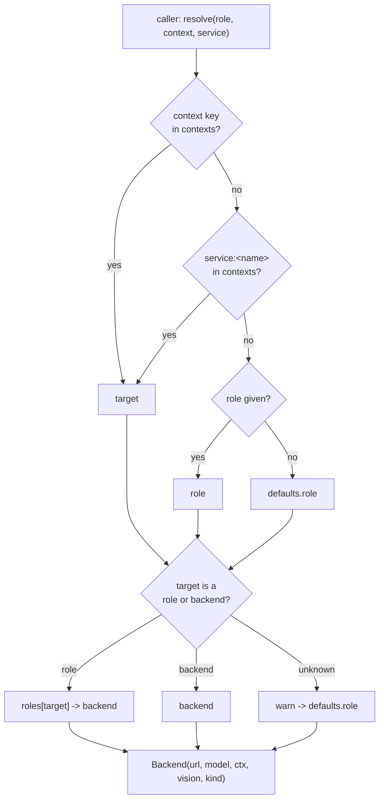
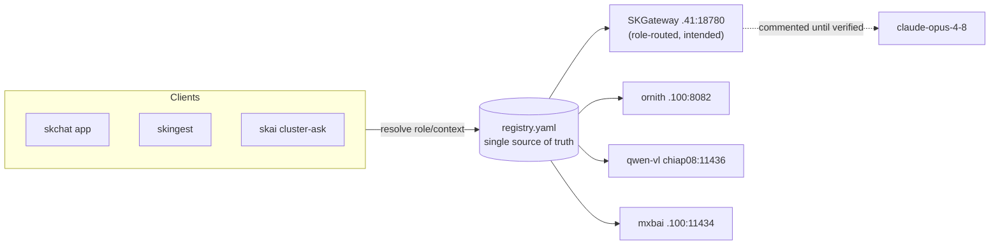

# skos Model Registry: single source of truth for model selection

Swapping a model should be editing **one place**. This registry makes that true
across roles, services, and per-context (group-chat / job) selection.

- **Live registry (synced):** `~/.skcapstone/models/registry.yaml`
  (synced via Syncthing, like `~/.skcapstone/coordination/`)
- **Committable template:** `~/clawd/skos/src/skos/models/registry.example.yaml`
- **Resolver library:** `skos.models` (`from skos.models import resolve`)
- **CLI:** `skmodels` (shim `~/.skenv/bin/skmodels`; also a `skos` console-script
  entry point `skmodels = skos.models.cli:main`)
- **Path override:** env `SKMODELS_REGISTRY`

## The four sections

| Section | What it is | Edit it to… |
|---|---|---|
| `backends` | concrete servable endpoints (`url` + `model` + `ctx` + `kind` + `vision`/`dim`) | **swap a model** (change one line) |
| `roles` | logical names code asks for (`sk-default`, `sk-synth`, `sk-code`, `sk-vision`, `sk-embed`) → a backend | re-route everything on a role at once |
| `contexts` | **the toggle**: override role/backend for ONE named context | pin a group-chat / job / service / agent to a different model |
| `defaults` | fallback `role` when nothing else matches (`sk-default`) | change the global default |

### Verified backends (2026-07-03, all live)

| Backend | url | model | kind | notes |
|---|---|---|---|---|
| `ornith` | `http://192.168.0.100:8082/v1` | `ornith-1.0-9b` | chat (ctx 65536) | .100 5060 Ti shared LLM (name-agnostic serving) |
| `qwen-vl` | `http://100.81.238.58:11436/v1` | `Qwen3.6-27b-abliterated-Q4_K_M` | chat, `vision: true` | chiap08 over Tailscale (LAN alt `10.0.0.139`); mmproj, OCR-verified |
| `mxbai` | `http://192.168.0.100:11434/api/embed` | `mxbai-embed-large` | embed (dim 1024) | live embedding default everywhere |
| `opus` *(defined, commented)* | `http://192.168.0.41:18780/v1` | `claude-opus-4-8` | chat | SKGateway route unverified, see below |

### Roles

```
sk-default -> ornith     sk-synth -> ornith     sk-code -> ornith
sk-vision  -> qwen-vl    sk-embed -> mxbai
```

## Precedence

```
context  >  service  >  role  >  default
```

- **context**: exact key match in `contexts` (e.g. `chat:dr-chiro-group`)
- **service**: key `service:<name>` match in `contexts` (e.g. `service:skingest.vision`)
- **role**: the logical role the caller asked for (e.g. `sk-vision`)
- **default**: `defaults.role`

A context target may be a **role** (`sk-*`) or a **concrete backend** name.
Unknown target → falls back to `defaults.role` with a stderr warning; it never
crashes.



## How to SWAP a model (one place)

Edit the backend line in `~/.skcapstone/models/registry.yaml`:

```yaml
backends:
  ornith:
    url: http://192.168.0.100:8082/v1
    model: ornith-1.1-12b        # <-- change here; every sk-default/synth/code follows
```

To re-point a whole role instead (e.g. send all synthesis to a different
backend), edit `roles.sk-synth: <backend>`.

## How to TOGGLE per group-chat / job / service

Use the CLI. This writes the `contexts:` block:

```bash
skmodels set chat:dr-chiro-group sk-vision     # this group chat now uses the VL model
skmodels set job:wiki-synth      sk-synth      # a batch job pinned to the synth role
skmodels set service:skingest.vision sk-vision # a service pinned to a role
skmodels set chat:12345 opus                   # pin one chat to a concrete backend
```

Resolve with the matching selector:

```bash
skmodels resolve --context chat:dr-chiro-group
skmodels resolve --service skingest.vision
skmodels resolve --role sk-synth
```

## CLI reference (`skmodels`)

| Command | Purpose |
|---|---|
| `skmodels list` | roles + backends + contexts + default |
| `skmodels get <role\|context>` | what a role/context resolves to |
| `skmodels resolve [--role R] [--context C] [--service S] [--json]` | print url + model (full precedence) |
| `skmodels set <context-key> <role\|backend>` | the toggle (writes `contexts:`) |
| `skmodels test <role\|context>` | curl the backend `/models` (or `/api/tags`) and report up/down |

## Library reference (`skos.models`)

```python
from skos.models import resolve, load_registry, list_roles, set_context

b = resolve(role="sk-vision")            # Backend(url, model, ctx, vision, kind)
b = resolve(context="chat:dr-chiro-group")
b = resolve(service="skingest.vision")   # looks up contexts["service:skingest.vision"]
b.url; b.model; b.ctx; b.vision; b.kind
```

- `load_registry(path=None)`: path from arg > `$SKMODELS_REGISTRY` > default.
- `resolve(role, context, service)`: precedence context > service > role > default.
- `list_roles()`, `list_backends()`, `list_contexts()`.
- `set_context(key, target)`: writes the YAML (drops comments, the live file is
  data; the committed `.example.yaml` keeps the documented comments).

## Wired reference implementations

Both keep an **env fallback** (nothing breaks if the registry is missing) and
**env still wins** if the operator sets it explicitly:

| Consumer | Role | File |
|---|---|---|
| skingest wiki synthesis | `sk-synth` | `skingest/src/skingest/config.py` (`WIKI_LLM_URL`/`_MODEL`, consumed by `synth.py`) |
| skingest vision OCR | `sk-vision` | `skingest/src/skingest/extract/vision.py` (`VISION_URL`/`_MODEL`) |
| skai cluster-ask | `sk-synth` | `skstacks-v2-work/v2/compute/skai/cluster-memory/cluster-ask.py` (`SKAI_LLM_URL`/`_MODEL`) |

> Registry backend urls include the trailing `/v1`. `vision.py` builds `/v1/...`
> paths itself, so its wiring strips a trailing `/v1` from the resolved url.

## SKGateway (.41:18780) integration (intended, not yet wired)

SKGateway already routes skchat/Opus traffic by an in-app model picker
(`claude-opus-4-8` ↔ `qwen3.6-27b`). The registry is designed to become the
gateway's routing table:

- Define a backend per gateway-reachable model (e.g. `opus` above, kept
  **commented** until the gateway `/v1` route is verified end-to-end).
- Map a role or a `chat:<id>` context to that backend.
- The gateway resolves the inbound request's role/context via `skos.models.resolve`
  and forwards to `backend.url` with `backend.model`.



Until that wiring lands, `opus` stays commented in the live registry so no role
accidentally resolves to an unverified route.
