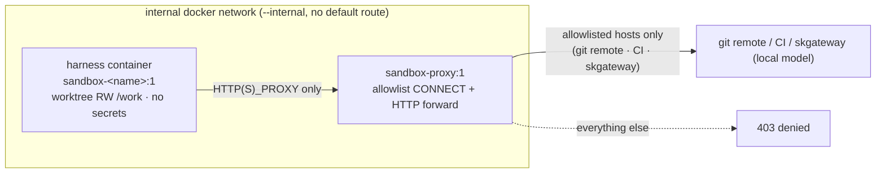

# SKOS Autopilot - Standard Operating Procedure

Companion to the design spec `skos-autopilot-architecture.md`. This is the
build / test / run / config / promotion / troubleshoot reference for operating
Autopilot v1.

## 1. What it is

A scheduled autonomy plane that reads work off the SKOS inputs (coord board
first), routes each item to a work-type executor, grades to a per-executor
quality gate, and reports what it did plus what needs a human decision as a
numbered digest the operator answers with a single number. GTD stays the spine;
Autopilot never invents a side store.

## 2. Posture: live execution is config-gated, dry-run by default

The default posture is unchanged and safe: `skos autopilot run` is dry-run, runs
against a deterministic `StubHarness` that never spawns a model, and writes
nothing. `live_execution` stays config-gated (default `false`) and double-locked
(the CLI refuses, and `Sandbox.spawn` raises, unless it is set).

What HAS shipped since the original v1 posture: the v1.5 sovereign sandbox (Docker
confinement + pinned egress, section 13, coord `07c78c7f`) is built and its
confinement proof is green, and operator-gated live canaries have succeeded on all
three real harnesses (claude-code on the operator's Max OAuth, and pi + opencode
routed to a local model via skgateway). So live execution is no longer "disabled,
do not enable"; it is "enabled by the operator, per node, only after the
confinement proof passes on that node." The security invariant that gates it is
still the one from the 2026-07-12 review: a confined session cannot read secrets
(they are absent from the container, not merely denied) and cannot reach an
off-allowlist host. Section 13 is the harness-selection + enablement procedure.

## 3. Build and install (skcapstone first)

1. Land and install the skcapstone coord foundations on .158 (noroc2027):
   `cd ~/clawd/skcapstone-repos/skcapstone && pip install -e .`
   (Task.meta, Board.score_task/update_task/close_task_obsolete, unblocked +
   stale-claim helpers, coord score CLI + coord_score MCP). Hard prerequisite.
2. Install skos: `cd ~/clawd/skos && pip install -e .`
3. Confirm the CLI group: `skos autopilot --help`.

## 4. Test

- skos: `cd ~/clawd/skos && python -m pytest tests/ -q`
- skcapstone: `cd ~/clawd/skcapstone-repos/skcapstone && python -m pytest tests/test_coordination.py -q`
- The real-harness seam test spawns `claude -p` against a throwaway fixture repo
  and is gated behind an env flag (`RUN_HARNESS_IT`) so a box without the Claude
  binary skips it. It stays skipped by default and does not run live in v1.

## 5. Configure

- Config file: `~/.skcapstone/config/autopilot.yaml` (copy from
  `~/clawd/skos/docs/examples/autopilot.yaml`). Fields: `enabled`, `harness`,
  `allowed_tools`, `repo_map`, `automerge_repos`, `caps`, `digest_chat`,
  `dry_run_summary`, `epic_id`. Start with `enabled: false`.
- `repo_map` keys use the `repo:<name>` tag convention. A coord task is
  engineering-eligible only if it carries exactly one known `repo:<name>` tag.
- `automerge_repos` stays EMPTY. In v1 nothing auto-merges (posture C). Even
  post-v1.5, a repo auto-merges only when it is BOTH in `automerge_repos` AND
  `repo_map[name].automerge: true` AND `ci` is not `none` AND external CI is green.
- Digest DM target: `digest_chat` (Chef's DM). Delivered via `sk-alert`.

## 6. Run and promote (v1: dry-run only)

- `skos autopilot run --once` (dry-run is the default). Genuinely read-only: no
  coord/GTD writes, no merges, no DM beyond one opt-in summary. Runs against the
  StubHarness, reports what it would do to the run journal.
- `skos autopilot run --no-dry-run` / `--canary`: return "disabled in v1
  (posture C)" and do nothing. These come online in v1.5 after the sandbox.

Scheduled daily run: the `autopilot-daily` block for
`~/.skcapstone/config/jobs.yaml` (schedule 30 6 * * *, node noroc2027,
flock-guarded, sk-cron-run wrapped, retries 0, catchup false). Generate it with
`python -c "from skos.autopilot import config; print(config.render_autopilot_job_yaml())"`,
paste under `jobs:`, and verify with `skcapstone scheduler list | grep autopilot-daily`.

## 7. Answer the morning digest

`skos autopilot answer <n> [response]` (for example `skos autopilot answer 1 yes`).
The resolver is idempotent: re-answering a number is a no-op. The Telegram reply
door is v1.5.

## 8. Inspect

- `skos autopilot status` - latest run (phase, items, scores, tokens/cost, PRs).
- `skos autopilot list [--decisions|--runs|--claims]`.
- `skos autopilot show <run_id>` - one run's per-item trajectory.
- `skos autopilot send [--preview]` - rebuild and send (or preview) the digest.

## 9. Revert

`skos autopilot revert <task_id>` reverts the recorded merge commit and reopens
the coord task. Only meaningful once auto-merge is enabled (v1.5+); in v1 nothing
auto-merges so there is nothing to revert.

## 10. Kill switch and ceilings

- Kill switch: set `enabled: false` in autopilot.yaml, or export
  `SKOS_AUTOPILOT_OFF=1`. Checked at the top of every phase and before every
  finalize; the current run stops cleanly at the next checkpoint.
- Hard ceilings: `caps.max_tokens_per_run`, `caps.max_usd_per_day`. On breach
  Autopilot stops selecting new work, escalates a "budget hit" digest item, exits.
- Board-flood control: `caps.new_tasks_per_run` (default 10); deep-dive tasks are
  tagged `autopilot-untriaged` and are never auto-selected.

## 11. Single-node constraint (hard)

All coord task-file mutation (score_task, update_task, obsolete-close) is safe
ONLY because `autopilot-daily` is pinned to `nodes: [noroc2027]`. A second
concurrent task-file writer, or unpinning the node, reintroduces the Syncthing
write-conflict class the coordination design eliminates. The same flock lock path
is taken by every entry point, including a manual `skos autopilot run`, so an
ad-hoc run cannot overlap the scheduled one.

## 12. Troubleshoot

- Nothing selected: check tasks carry exactly one known `repo:<name>` tag, are
  unblocked (every dependency in some agent's completed_tasks), and are not tagged
  `autopilot-untriaged`.
- No digest DM: confirm `sk-alert` sends (token in `~/.hermes/.env`) and
  `digest_chat` is set; in dry-run the DM is suppressed unless `dry_run_summary`
  is opted in.
- Wedged task: a crashed run's claim is a lease; Phase 0 of the next run releases
  an autopilot-claimed uncompleted task older than `run_timeout` and prunes its
  worktree.
- "live harness execution is disabled" on `--no-dry-run`/`--canary`: expected
  when `harness.live_execution` is false (the default). Set it true in
  `autopilot.yaml` (section 13) only after the confinement proof is green on the
  node.

## 13. The sovereign sandbox and harness registry

The sovereign-sandbox build replaces bwrap confinement with a disposable Docker
container and makes the harness a swappable registry. Every harness runs inside
the same confinement (worktree bind-mounted read-write at `/work`, nothing secret
present, `--read-only` / `--cap-drop ALL` / `--no-new-privileges`, non-root uid)
with its only egress a sovereign allowlist proxy sidecar. Full design: `skos-autopilot-architecture.md`
section 12, `docs/superpowers/specs/2026-07-13-autopilot-v15-sovereign-sandbox-design.md`.



### 13.1 Build the sandbox images

`docker/sandbox/build.sh` builds `sandbox-proxy:1` plus one image per harness and
verifies the baked CLI version of each.

- `docker/sandbox/build.sh` builds all four (proxy, claude, pi, opencode).
- `docker/sandbox/build.sh pi opencode` builds a subset; `--no-cache` forces a
  clean rebuild; `-h` prints usage.
- All four build with plain `docker build` from the repo root. No `--network host`
  or npm registry egress is required at build time: opencode's binary already
  bundles its `@ai-sdk/openai-compatible` provider, and pi/claude install their
  CLIs during the build.
- A node missing these images **fails closed**: `Sandbox.spawn` cannot run there,
  so no unconfined execution is ever attempted. Rebuild after changing
  `sandbox_proxy.py` (proxy image) or a harness Dockerfile.

### 13.2 Run the confinement proof

Before enabling live execution on a node:

```
RUN_SANDBOX_IT=1 python -m pytest tests/test_sandbox_confinement_it.py -q
```

This is the evidence gate, not a formality: it asserts on real containers that
skcapstone/secrets are absent, the rootfs is read-only, an off-allowlist host
(example.com) gets 403, an on-allowlist host (github.com) gets 200, and a direct
no-proxy socket is blocked.

### 13.3 Choose a harness

Set `autopilot.yaml: harness.name` (default `claude-code`). `pi` and `opencode`
route to a local model via `harness_model` + `harness_base_url` (point at
skgateway), keeping all inference egress on the tailnet with no public-internet
leg. All three real harnesses are proven live end-to-end in the confined sandbox.

| harness | model channel | verified live | timing (one classify prompt, ornith-tiny) | notes |
|---|---|---|---|---|
| `claude-code` | Anthropic (operator Max OAuth) | yes (full executor + orchestrator canary) | n/a | v1 default; not a local model |
| `pi` | local via skgateway | yes | ~3.6s, clean exit, single turn | **cleanest sovereign harness**: one turn then terminates, no cap needed |
| `opencode` | local via skgateway | yes | bounded to `run_timeout` (300s default) | functional but **agent-loops past its first answer** (wasteful on a heavy thinking model); the adapter bounds the run and parses the first-chunk answer |
| `codex` | n/a | no (fail-closed stub) | n/a | placeholder |

Practical guidance: for the eventual claude-code replacement, lead with `pi`
(fast, single-turn, deterministic) and keep `opencode` as a working fallback.
`opencode` returns the correct answer in its first streamed event; the adapter's
bounded `run_timeout` + first-valid-JSON parse make it deterministic despite the
over-run, but it is slower and burns more tokens than pi.

Harness-tuning knobs in `autopilot.yaml`: `harness_model`, `harness_base_url`,
`harness_max_tokens` (generous default 131072 so a thinking model does not exhaust
its budget on reasoning), and (pi/opencode) `harness_run_timeout`.

### 13.4 Enable live execution (two-key act)

Both must be true; neither alone is enough:

1. `harness.live_execution: true` in `autopilot.yaml`.
2. An explicit `skos autopilot run --no-dry-run --canary --task <id>` (a canary
   targets exactly one task and stays PR-only while `automerge_repos` is empty).

Do this only after the confinement proof (13.2) is green on that node. The canary
runs the full pipeline on one task, ends at an open PR, and queues a "merge?"
decision to GTD.

## 14. References

- Design: `skos-autopilot-architecture.md` (section 12 = harness security model,
  section 21 = adopted Archon patterns).
- Coord scoring: `../../skcapstone-repos/skcapstone/docs/autopilot-coord-scoring.md`.
- v1.5 sovereign sandbox: coord `07c78c7f`. Archon-leverage epic: coord `49a74ed2`.
- v1.5 spec and plan:
  `docs/superpowers/specs/2026-07-13-autopilot-v15-sovereign-sandbox-design.md`,
  `docs/superpowers/plans/2026-07-13-autopilot-v15-sandbox.md`.
