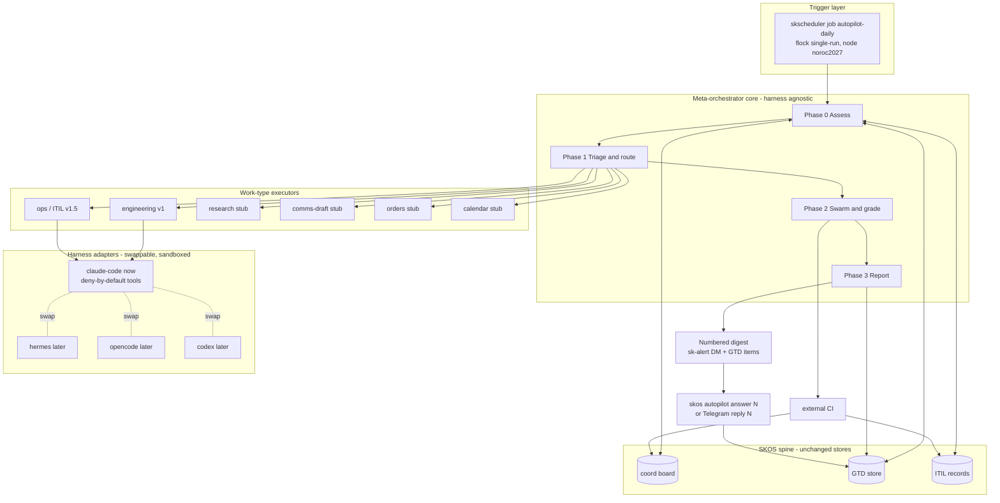

# SKOS Autopilot — Autonomous Assess / Plan / Swarm / Grade / Report over the GTD Spine

**Status:** design v2 (2026-07-12) · **Owner:** Lumina + Chef · **Epic:** (coord, to be filed)
**Companion SOP:** `skos-autopilot-SOP.md` (build / test / deploy / config / API, written alongside implementation)
**Depends on:** `gtd-ingest-architecture.md` (the port), `ARCHITECTURE.md` (ports/adapters idiom)
**Revision note:** v2 closes the findings of the three-lens grader pass (architecture 4/5, safety 2/5, completeness 3/5): a harness security model and untrusted-input firewall (section 12), an externally-CI-gated merge with revert (section 5), runbook blast-radius tiering and incident locking (section 6), a genuinely read-only dry-run plus a live canary (section 14), explicit data contracts and `repo_map` (section 10), claim leases and stale reclaim (section 5), and skcapstone-first sequencing (section 18).

**Goal:** a scheduled autonomy plane that reads work off the SKOS inputs (coord board first, then all GTD sources), routes each item to a work-type executor, runs it through a real execution primitive, grades the result until it clears a quality gate, and reports what it did plus what needs a human decision as a numbered digest the operator answers with a single number. Claude Code is the executor harness for now (paid subscription this month); the harness is a swappable seam so Hermes, a local-model loop, OpenCode, or Codex can take over later without touching the orchestrator, scheduler, coord, or GTD wiring.

---

## 1. Principles

1. **GTD stays the spine.** Autopilot never invents a side store. It reads and writes the unified GTD JSON store (`~/.skcapstone/coordination/gtd/*.json`) through the existing `skos.gtd_ingest` port, and the coord board and ITIL through their existing managers. One unified GTD, one coord board, one ITIL, no parallel lists.
2. **The loop is universal, the quality gate is per-executor.** The cycle (assess, route, produce verified output or a numbered question, report, operator answers by number) applies to every input. "Grade until 5/5 by running the code" is only the engineering executor's gate. Ops grades by verified resolution, comms grades by a staged draft the operator approves.
3. **Ports and adapters, harness-agnostic.** The orchestrator core defines interfaces (`Executor`, `HarnessAdapter`). Concrete harnesses and executors are plugged in and selected by name. The core contains no harness-specific or executor-specific logic; every model call goes through the `HarnessAdapter` (`assess`, `run_task`, `grade`). Swapping Claude Code for a local-model loop is an adapter change.
4. **Untrusted input is data, never instructions.** Coord descriptions, ITIL text, email, and Telegram content are attacker-influenceable. They are passed to the harness as clearly delimited data inside a fixed instruction frame, never concatenated into the instruction position. The harness runs under a deny-by-default tool allowlist and restricted egress (section 12).
5. **Safe by default, promote by evidence.** All code work happens in isolated git worktrees. Nothing merges to a mainline except in repos the operator has explicitly whitelisted, and only behind an external CI signal the implementing harness did not produce. The first live period is a genuinely read-only dry-run; the operator promotes to a single-task live canary, then to full live, by evidence. A global kill switch and a hard token/dollar ceiling bound every run. Every autonomous action is logged to the record it touched and to a run journal.
6. **Build on what exists.** The execution primitives already exist (`skscheduler` agent jobs via headless `claude -p`, coord claim/complete, `trustee_ops` audited remediation actions, `self_healing` diagnose/fix/escalate flow, `error_queue` bounded retry, `skjoule` workType taxonomy). Autopilot is the connective tissue, not a reimplementation.

---

## 2. Architecture at a glance



Three layers, each replaceable in isolation. **Trigger** decides *when* (a `skscheduler` shell job, `flock`-guarded, `sk-cron-run.sh`-wrapped). **Meta-orchestrator core** decides *what* and routes; it owns the cycle, the decision queue, the digest, and the resolver, and holds no harness-specific logic. **Executors** decide *how a work-type gets done*, each behind the `Executor` interface with its own quality gate; the **harness** seam sits inside each executor's produce and grade steps and runs sandboxed.

---

## 3. The meta-orchestrator: the daily cycle

`skos autopilot run --once` executes four phases. Each phase is resumable: the run journal (`~/.skcapstone/coordination/autopilot/runs/<run_id>.json`) records per-item state (`selected | claimed | implementing | round_k | finalized | escalated | error`), and a resumed run skips items already `finalized`/`escalated` and re-enters in-flight items at their recorded round.

### Phase 0 - Assess

- **Load inputs** from raw JSON (coord `tasks/*.json`, `agents/*.json`, ITIL records, GTD lists) so `meta` is visible.
- **Reclaim stale claims.** Any coord task claimed by `autopilot` but not completed, whose claim is older than `run_timeout` (default 1h), is released at the top of Phase 0 (a claim lease, section 5.1), and its worktree, if any, is pruned. This prevents a crashed run from wedging tasks forever.
- **Compute unblocked.** A coord task is actionable iff every id in its `dependencies` is in the union of all agents' `completed_tasks`.
- **Architectural validity pass** via `harness.assess(brief)` returning a `Verdict` of `{valid, stale, obsolete, needs_decision}`. `stale` rewrites `description`/`acceptance_criteria` in place through the new `Board.update_task` mutator (section 8), which records the prior values under `meta.autopilot.edits[]` so every autonomous edit is reversible and auditable. `obsolete` closes with a note. `needs_decision` becomes a numbered decision item. All three write-paths (`update_task`, close, score) share the single-writer raw-dict helper and are therefore bound by the single-node constraint of section 8.
- **Deep-dive spawn** creates new coord tasks tagged `autopilot` and `autopilot-untriaged`, capped at `caps.new_tasks_per_run` (default 10). Tasks tagged `autopilot-untriaged` are never auto-selected for execution; they require the operator to promote them (numbered digest item), which prevents the self-amplifying loop where the assessment feeds its own execution queue.

### Phase 1 - Triage and route

- Select items that are unblocked, `valid`, in an in-scope repo, matched to an executor whose gate can run autonomously, and whose `selectable(item)` is true.
- Route by `source` plus content classification, aligned to the `skjoule` workType vocabulary.
- Non-selectable or decision-shaped items are placed on the decision queue directly by the orchestrator (the executor's `escalate` is called only for items that were selected and then failed their gate mid-run; a `selectable=False` item is queued without ever entering `run`).

### Phase 2 - Swarm and grade

- Each routed item runs its executor's produce-then-grade loop under a global concurrency cap (`caps.max_concurrent`, default 3) and the run token/dollar ceiling (section 14). Each grading round's score is written to the source record.
- Concurrent merges to a single integration branch are serialized per repo (a per-repo in-run lock), so two tasks finishing at once cannot race the same branch.
- Cleared-gate items are finalized (section 5.5 / 6.2); non-converging items are escalated with the specific blocker.

### Phase 3 - Report

- Build the morning numbered digest from the unanswered decision queue plus a completed-work summary, DM it via `sk-alert`, and write each decision to GTD as a `source="autopilot"` item (so it survives in `skcapstone gtd`).
- Write the run summary to the journal. On failure of the run itself, `sk-cron-run.sh` captures a GTD item and fires an alert.

---

## 4. Work-type executors

No executor abstraction exists in the codebase today; adapters only capture and notify. Autopilot introduces one. The full data contracts (`WorkItem`, `RepoSpec`, `AssessBrief`, `TaskBrief`, `GradeBrief`, `GateResult`, `Verdict`, `HarnessResult`, `DecisionItem`) are defined in section 10.

```python
# skos/autopilot/executor.py
class Executor(Protocol):
    kind: str
    def selectable(self, item: WorkItem) -> bool: ...              # act without the operator?
    def run(self, item: WorkItem, harness: HarnessAdapter) -> GateResult: ...  # produce + grade loop
    def finalize(self, item: WorkItem, result: GateResult) -> None: ...        # merge / resolve / stage
    def escalate(self, item: WorkItem, reason: str) -> DecisionItem: ...       # to the numbered queue
```

| Executor | Maps to inputs | Quality gate | v1 state |
|---|---|---|---|
| **engineering** | coord tasks, itil changes/RFCs, manual code items | code review 1-5, 5/5 requires new tests + pre-existing suite green + diff-coverage + external CI (section 5) | **REAL, end-to-end** |
| **ops** | itil incidents/problems, cron failures, service-health | verified resolution: runbook verification passes AND independent health green AND no collateral AND no re-failure in one cycle (section 6) | **REAL (v1.5, designed here, built next)** |
| research | email-read, telegram, manual, calendar prep, corpus queue | citation / verification check (deep-research verify pass) | stub |
| comms-draft | email, telegram | staged draft only, never auto-send, operator approves by number | stub (precedent: `mail.py` reply-as-draft) |
| orders | order adapter | vendor state-change confirmation | stub |
| calendar | calendar adapter | prep / conflict check | stub |

Stubs are real classes: `selectable` returns `False` (so `run` is never called), and they exist only to make the routing table total. They are covered by a smoke test asserting they register and never self-select.

---

## 5. The engineering executor (v1, full end-to-end)

### 5.1 Repo resolution, selection, and the claim lease

**Repo resolution.** The coord `Task` model has no `repo` or `epic` field (only `title`, `description`, `tags`, `dependencies`, `acceptance_criteria`). Autopilot resolves a task's repo by a **`repo:<name>` tag convention**: a task is engineering-eligible only if it carries exactly one `repo:<name>` tag whose `<name>` is a key in `repo_map` (section 10). Tasks with no `repo:` tag or an unknown one are not selectable and, if otherwise valid, are queued as a numbered "which repo / add to repo_map?" decision. (A future `Task.repo` field is optional; the tag convention needs no model change and is back-compatible.)

**`selectable(item)`** is true when: unblocked and `valid`; exactly one known `repo:<name>` tag; the task is code-shaped (has acceptance criteria or a clear deliverable); and it is not tagged `autopilot-untriaged`. It then claims the coord task (`Board.claim_task("autopilot", task_id)`) before any work, so a second runtime cannot double-execute.

**Claim lease.** The claim is a lease: the run journal records `claimed_at`. Phase 0 of any run releases an `autopilot`-claimed, uncompleted task whose `claimed_at` is older than `run_timeout` and prunes its worktree. So a crash never permanently wedges a task.

### 5.2 Produce (implement)

The harness implements in an **isolated git worktree** for the task's repo (`repo_map[name].path`, branched from `base_branch`). Implementation is test-driven: failing test first, then code, matching the repo's conventions. The worktree keeps parallel tasks from colliding. `test_cmd` comes from `repo_map`, not an assumption of `pytest`.

### 5.3 Grade (the 1-5 loop)

An **independent grader** reviews the change. Independence is strengthened per the safety review: the grader runs in a **separate harness invocation** (fresh session, no shared context with the implementer) and, critically, the authoritative pass/fail signal is an **external CI run the harness does not execute** (section 5.5). The grader's 1-5 score adds judgment on top of CI, it does not replace it.

The loop: implement, grade, if score < 5 feed specific feedback back to the implementer, re-grade. **Round cap 4.** Every round's score is written to `meta.autopilot.scores[]` (section 8). Reaching 5/5 finalizes; non-convergence in 4 rounds escalates with the last score and gap.

### 5.4 The rubric (1-5)

Aligned to the `skjoule` verification ladder (self, peer, auto). A 5 is peer-verified and auto-checkable, and requires evidence, not opinion:

| Score | Meaning |
|---|---|
| 5 | Correct, tested, simple, secure, fits the architecture, AND: new tests written and passing, **the pre-existing suite still green (regression gate)**, **diff-coverage over the changed lines meets `repo_map[name].min_diff_coverage` (default 0.8)**, and **the external CI signal is green**. Mergeable. |
| 4 | Correct and tested but one clear gap (a missing edge case, a simpler form, a minor convention mismatch, or diff-coverage just under threshold). |
| 3 | Works on the happy path but has a real weakness (thin tests, a likely edge-case bug, notable complexity). |
| 2 | Runs but fails part of its acceptance criteria, or tests do not exercise the change (fails the coverage check). |
| 1 | Does not meet the task, does not build, or any suite fails. |

The grader must name the specific gap that cost each missing point.

### 5.5 Finalize, external CI gate, and rollback

**Obtaining the external CI verdict** (the load-bearing merge control, computed outside the implementing harness). `RepoSpec.ci` selects the mechanism:
- `ci: "github-actions"`: after the PR head is pushed, autopilot uses the `gh` CLI in a separate process to locate the workflow run for the exact head sha (`gh run list --branch <pr-branch> --json headSha,databaseId,status,conclusion`), polls it up to `RepoSpec.ci_poll_timeout` (default 1200s), and takes `conclusion=="success"` as green, `failure/cancelled/timed_out` as red, and a poll timeout as red (never green-on-unknown). The verdict fills `GradeBrief.ci_status`.
- `ci: "local:<cmd>"`: autopilot runs `<cmd>` as a separate subprocess (not inside the harness session) from the worktree; exit 0 is green.
- `ci: "none"`: external CI is **waived**, so **auto-merge is disallowed for that repo regardless of `automerge`** (it is always PR-only). A 5/5 is still reachable via new tests + regression + diff-coverage, but the merge is human-gated. The rubric's "external CI green" clause is satisfied vacuously only for the purpose of scoring, never for the purpose of auto-merging.

**Diff-coverage** is computed outside the harness too: `RepoSpec.coverage_cmd` (for example `pytest --cov --cov-report=xml`, or any command emitting a Cobertura/lcov report) runs in the worktree, and a diff-cover pass compares the report against the PR diff to produce the changed-lines coverage ratio, checked against `RepoSpec.min_diff_coverage`. A repo with no `coverage_cmd` cannot reach 5 on the coverage clause and is therefore PR-only (never auto-merge), the same treatment as `ci: "none"`.

- **Auto-merge** happens only when the repo is in the `automerge_repos` list AND `ci` is not `none` AND external CI is green AND diff-coverage passes. The `automerge_repos` list is the operative, operator-controlled live gate; the per-repo `RepoSpec.automerge` bool is a static opt-in that must also be true, so a repo auto-merges only when both agree (a repo can be pre-marked `automerge: true` in `repo_map` yet stay PR-only until the operator adds it to `automerge_repos`). It lands as a single revertible merge commit recorded in `meta.autopilot.merge = {sha, pr, branch, ts}`, and completes the coord task (`Board.complete_task`, which mints Joules). `automerge_repos` stays empty until the operator has watched canary runs and named a first repo.
- **Otherwise PR-only:** open the PR, queue a numbered "merge PR #N for task X?" decision, leave the task claimed (not completed) until the operator approves.
- **Rollback.** `skos autopilot revert <task_id>` reverts the recorded merge commit and reopens the coord task (removes the completion, re-adds to the board with a note). A post-merge CI failure on the integration branch auto-files a numbered "auto-revert task X?" decision (auto-revert if the repo opts in via `repo_map[name].auto_revert: true`).

---

## 6. The ops executor (self-triaging ITIL, v1.5)

Ops self-triages ITIL incidents and remediates the known ones, mirroring `SelfHealingDoctor`'s diagnose / fix / verify / escalate flow and writing state through `ITILManager`. **Relationship to existing loops:** ops is the single owner of ITIL-record remediation. `self_healing` (agent-home self-repair) and `make_service_health_task` (detection) keep their roles; ops takes an **exclusive incident lock** (below) so no two loops remediate the same CI at once.

### 6.1 Ingress (close the two producer gaps first)

- **cron to ITIL bridge (new).** `sk-cron-run.sh` failures create only a GTD item today. Add a reader over `~/.skcapstone/logs/cron-ledger.jsonl` (`ok:false`) that calls `ITILManager.create_incident(source="daemon_error", affected_services=[job], ...)`. The `daemon_error` source exists in the schema with no producer.
- **service-health (unchanged).** Already creates deduped incidents (`source="service_health"`).

### 6.2 The triage flow

1. **Acquire incident lock.** ITIL records have no claim today. Ops writes an exclusive lock file `~/.skcapstone/coordination/itil/locks/<incident_id>.lock` (single-node, `flock`-style) and, for the affected CI, sets a remediation window that **mutes `make_service_health_task`** for that CI (a suppress-list the health task consults) so the brief down-state during a restart cannot file a duplicate incident or trip a second remediation.
2. **Classify severity** from the matched runbook `severity` else the incident's; adjust via `update_incident`.
3. **KEDB search:** `search_kedb(title + services + impact)`. Recall improvement (substring-only today, empty `symptoms`): also key on `affected_services -> ci` and optionally embed with mxbai (section 16 gap-fills).
4. **Runbook match and the safety gate.** New `RunbookIndex` parses `runbooks/*.md` frontmatter and matches `affected_services == ci` (exact) plus `symptoms` overlap. A runbook is **safe to auto-execute** only if ALL hold: its new `blast_radius` frontmatter tier is `<= caps.max_auto_blast_radius` (default `low`); no command in its `## Remediation` block matches the global **denylist** (`rm -rf`, `dd`, `mkfs`, `DROP`, `TRUNCATE`, `systemctl stop` of a non-target unit, `iptables`, `kms`/key ops, `sk-access run` on another node); and every command in the block parses into the **reversible-operations allowlist**: `systemctl restart|start|reload <target-unit>`, `docker restart|start <target>`, `docker compose up -d|restart`, a service's own health/status probes (`curl`, `pg_isready`, `systemctl status`, `docker ps`), `mkdir -p`, and `chmod`/`chown` within the CI's own data path. A command that does not parse cleanly into this allowlist (or matches the denylist) fails the gate. Anything failing this escalates instead of executing. Symptom-overlap-only matches (no exact `ci`) never auto-execute; they escalate.
5. **Remediate.** Move `detected -> acknowledged -> investigating`. Execute the vetted remediation wrapped in `ErrorQueue.enqueue(...)` + `retry(handler)` (bounded backoff, max 3). Team-agent-scoped failures use `TrusteeOps.restart_agent/rotate_agent` (already audited). Every attempt is audited (`_trustee_helpers.write_audit`) AND logged to the incident `timeline` via `update_incident(note=...)`.
6. **Verify (the ops gate).** Resolved-and-verified requires ALL: the runbook `## Verification` block exits 0 with expected output; an **independent** health signal is green (`service_health.check_all_services()` up, or a fresh `sk-cron-run.sh` re-run writes `ok:true`); a **collateral check** confirms no unexpected service went down and no monitored data path shrank (a lightweight before/after snapshot of the affected CI's peer services and any declared data path in the runbook); and no re-failure within one health cycle (5 min). The verification block is authored in the same file as remediation, so it alone is not trusted: the independent health signal plus collateral check are what actually pass the gate. Only then `update_incident(new_status="resolved", ...)` (auto-completes the linked GTD item). Release the incident lock and remediation window.
7. **Recurring to Problem.** New recurrence detector: if `list_incidents(service=svc)` shows >= N in a window, `create_problem(related_incident_ids=[...])`, link back, and on root cause `update_problem(new_status="known_error", create_kedb=True)` with real symptoms.
8. **Infra change to CAB (human-gated).** Autopilot **only ever proposes `change_type="normal"`** (never `standard`), so every autopilot-originated change requires a human CAB vote; it never gets the `standard` auto-approve path. It proposes with `rollback_plan`/`test_plan` and escalates a numbered CAB decision. The operator's approving vote must be cast with `agent="human"` (the approver string `_evaluate_cab` looks for). The ops executor's own votes always carry its agent name and it refuses to ever cast `agent="human"`; note this is a convention (the `agent` field is unauthenticated free text), reinforced by the propose-normal-only rule so a misclassification cannot buy an auto-approve.
9. **Unknown or unsafe to escalate.** No KEDB hit and no safe runbook, remediation exhausted, or an SLA breach escalates via `_send_message_impl(recipient="chef", urgency="critical")` / `SelfHealingDoctor._escalate` and moves the incident to `escalated`.

### 6.3 Gaps this executor must build

cron-to-ITIL bridge; runbook matcher/executor/verifier with the `blast_radius` frontmatter and denylist; KEDB recall + direct-write with symptoms; recurrence detector; active SLA escalation (today only logs, only inspects `detected`); a live `ErrorQueue` drainer; remediation-to-timeline logging; the incident lock + health-task suppress-list. Scoped to v1.5.

---

## 7. Other executors (stubbed)

Each is a registered class with `selectable=False`; matched items are queued to the operator by the orchestrator (their `escalate` is not invoked, per section 3). Future gates: research uses the deep-research verify pass; comms stages a draft and never sends (matching `mail.py` reply-as-draft) and queues a numbered approval; orders adds proactive vendor actions gated by confirmed state change; calendar adds prep/conflict checks. They exist so widening autopilot is adding a `run` body, not new plumbing.

---

## 8. The rating / scoring system (skcapstone coord extension)

Coord tasks are one JSON per file. The `Task` pydantic model has no `meta` field and drops unknown keys on validate, but **`Board` exposes no task-mutation method at all**: `create_task` is the only writer and it is write-once (it never rewrites an existing task file; claim/complete write only to `agents/*.json`). So a raw-dict field written onto a task file is never stripped in practice, because nothing ever re-dumps that file through the model. (Earlier drafts cited pre-existing `report`/`done_at` keys as evidence; that is not reproducible in the current live store, so the argument rests on the no-mutation-method fact, not on legacy keys.)

The minimal clean extension:

1. **Add one model field** in `coordination.py`: `meta: dict = Field(default_factory=dict)`. Existing files default to `{}`; `load_tasks`/`get_task_views` now preserve and expose it. No migration.
2. **Add a mutating writer** `Board.score_task(...)` operating on the **raw dict** (not `model_dump()`), so it preserves any non-model keys. It is a deliberate exception to the "tasks are immutable" protocol. **It is safe only because `autopilot-daily` is pinned to a single node (`nodes: [noroc2027]`).** A second concurrent writer, or unpinning the node, reintroduces exactly the Syncthing task-file write-conflict class the coordination design eliminates. Any future multi-node harness MUST serialize task-file writes (a coord-side lock) before this can run off a single box. This coupling is a hard constraint, recorded here and in the SOP.

   A sibling `Board.update_task(task_id, description=None, acceptance_criteria=None, add_tags=None)` backs the Phase-0 `stale` action. It shares the same atomic raw-dict helper (`tmp + os.replace`) and the same single-writer constraint, and it snapshots each field it changes into `meta.autopilot.edits[]` (`{field, old, new, ts, run_id}`) so every autonomous edit is reversible and auditable. `score_task`, `update_task`, and the obsolete-close path are the only three mutating writers autopilot adds, and all three go through that one helper.

```python
def score_task(self, task_id, round, score, notes="", harness="", phase=None, ref=None) -> Path:
    # locate tasks/<id>-*.json, json.load raw dict
    # ap = d.setdefault("meta", {}).setdefault("autopilot", {})
    # ap.setdefault("scores", []).append({"round":round,"score":score,"notes":notes,
    #     "ts":now_iso(),"harness":harness})
    # if phase: ap["phase"]=phase
    # if ref: ap["pr" if ref.startswith("http") else "artifact"]=ref
    # atomically write d back (tmp + os.replace), all keys preserved
```

3. **Surface it** as `skcapstone coord score <id> --round N --score S ...` and an MCP `coord_score` tool. Stored shape: `task.meta.autopilot = {phase, pr|artifact, merge:{sha,pr,branch,ts}, harness, scores:[{round,score,notes,ts,harness}]}`.

ITIL records already carry `timeline`, so ops grading/attempts log there with no schema change.

---

## 9. The numbered digest and respond-by-number

### 9.1 Producing and storing decisions

Each decision is written through `skos.gtd_ingest` with `source="autopilot"` (the port writes `source` verbatim; the skcapstone `gtd capture` CLI would coerce an unknown source to `manual`, so the port is used, not the CLI). Because `capture()` returns `None` on a duplicate `(source, source_ref)`, the writer uses a **content-stable `qid`** and, on `None`, falls back to `upsert()` so the item is guaranteed present and the resolver's `source_ref` always resolves (a resumed or re-run phase never drops or dangles a decision):

```python
qid = stable_qid(decision)                       # deterministic hash of the decision
c = GtdCapture(text=..., source="autopilot", source_ref=f"autopilot:{qid}",
               status="waiting", context="@decide", priority="high",
               meta={"decision": {"qid": qid, "prompt": ..., "options": {...},
                                  "answered": False, "answer": None, "action_ref": ...}})
gid = capture(c)
if gid is None:                                   # already existed: ensure state, don't drop
    _id, _action = upsert(c)
```

The per-digest ordinal lives in one manifest in the GTD dir, `autopilot-digest.json` (`{digest_date, sent_at, items:[{n, qid, id, source_ref, prompt, options, answered}]}`), rebuilt each morning over unanswered `autopilot` items ordered by priority then created_at, so numbers are stable within a day.

### 9.2 The morning DM

Sent via `sk-alert` (Bot API to the operator DM), standing on the authoritative JSON store (not the nextcloud-markdown surface the 7:15 brief reads):

```
Morning decisions (reply with the number):
1. Merge PR #123 for skrender reloader task?  [yes/no/defer]
2. CAB approve normal change chg-abcd (coturn cutover)?  [approve/reject]
3. Task 014b0318 stuck at 4/5 (thin tests), keep trying or hand to you?  [retry/take]
Reply "1 yes" or just "1".
```

### 9.3 Resolving (one resolver, two front doors)

`skos.autopilot.resolver.answer(n, response)` reads the manifest, finds `(qid, source_ref)`, records the answer, transitions the GTD item via `gtd_ingest.upsert`, marks the manifest answered, and optionally fires `action_ref`. Idempotent. Two front doors converge on it: the `skos autopilot answer <n> [response]` CLI (buildable now), and a `_handle_autopilot_reply` intercept in `telegram_bridge.py` (mirroring the `/model` slash-command handler, plus an `ap:<qid>:<opt>` branch in `_handle_callback` for inline buttons). **v1 ships the CLI door; the Telegram door is v1.5** once Open Decision 1 (which bot owns the intercept) is resolved, so v1 does not block on it.

---

## 10. Data contracts

```python
# skos/autopilot/types.py
@dataclass
class WorkItem:
    kind: str; ref: str; source: str; repo: str | None; payload: dict

@dataclass
class RepoSpec:                       # one entry of repo_map (autopilot.yaml)
    name: str; path: str; base_branch: str; integration_branch: str
    test_cmd: str; ci: str            # "github-actions" | "local:<cmd>" | "none"
    coverage_cmd: str | None = None   # emits Cobertura/lcov; None -> PR-only (no auto-merge)
    ci_poll_timeout: int = 1200       # seconds to poll github-actions before treating as red
    automerge: bool = False; auto_revert: bool = False; min_diff_coverage: float = 0.8

@dataclass
class AssessBrief:                    # Phase 0 assess input
    task_id: str; title: str; description: str
    acceptance: list[str]; tags: list[str]; repo: str | None
    codebase_context: str             # brief current-state notes for the judgement

@dataclass
class TaskBrief:                      # implement input
    task_id: str; repo: RepoSpec; worktree: str
    title: str; description: str; acceptance: list[str]
    prior_feedback: str | None; round: int

@dataclass
class GradeBrief:                     # grade input
    task_id: str; repo: RepoSpec; worktree: str; diff: str
    acceptance: list[str]; ci_status: str        # green | red | pending | none
    diff_coverage: float | None                  # changed-lines coverage ratio, or None

@dataclass
class GateResult:
    score: int | None; passed: bool; notes: str; artifact: str | None

@dataclass
class Verdict:                        # Phase 0 assess output
    verdict: str; reason: str          # valid | stale | obsolete | needs_decision
    updated_description: str | None = None
    updated_acceptance: list[str] | None = None

@dataclass
class HarnessResult:
    ok: bool; artifact: str | None; tokens: int; cost_usd: float; raw: dict

@dataclass
class DecisionItem:
    qid: str; prompt: str; options: dict; action_ref: str | None; priority: str
```

`repo_map` in `autopilot.yaml` is `{name: RepoSpec}`. The engineering executor builds a `TaskBrief` from the coord task + resolved `RepoSpec` + fresh worktree, passes it to `harness.run_task`, then a `GradeBrief` (with the diff and external CI status) to a fresh `harness.grade`.

---

## 11. The harness adapter seam

```python
# skos/autopilot/harness.py
class HarnessAdapter(Protocol):
    name: str
    def assess(self, brief: AssessBrief) -> Verdict: ...     # Phase 0 judgement
    def run_task(self, brief: TaskBrief) -> HarnessResult: ... # implement in a worktree
    def grade(self, brief: GradeBrief) -> GateResult: ...    # fresh-session review
```

`assess` is on the adapter so the core stays harness-agnostic (Phase 0 needs a model, but the orchestration around it does not). `ClaudeCodeAdapter` (now) shells `claude -p` under the sandbox of section 12 and drives Workflow/subagents inside that session for the swarm and grade. Future `Hermes`/`OpenCode`/`Codex`/local-loop adapters implement the same three methods; selected by `--harness`, default `claude-code`. Nothing above the seam changes when the harness changes.

---

## 12. Harness security model (deny by default)

This section exists because the harness runs headless with `--dangerously-skip-permissions` and is fed attacker-influenceable text; it is the top safety control.

- **Tool allowlist, deny by default.** `autopilot.yaml: harness.allowed_tools` is an explicit allowlist passed as `--allowedTools`. The autopilot harness is **never** granted, and the adapter hard-refuses to pass, any of: `capauth_secret_get`, `skstacks_secret_get/set`, `kms_*`, `trustee_*`, `run_ansible_playbook`, `sk-access run`/`exec`, `send_message`/`telegram_send`/`skchat_send`/`comm_notify` (outbound comms are exfil channels), and any fleet-wide `file_write` outside the task's worktree. The allowlist for engineering is essentially: Read/Edit/Write within the worktree, Bash scoped to the worktree and the repo test command, git, and the coord/gtd scoring tools. A denylist assertion in the adapter fails closed if a forbidden tool is ever requested.
- **Untrusted input is framed as data.** All external text (coord descriptions, ITIL text, email, Telegram) reaches subagents inside a fixed instruction frame with the untrusted content clearly delimited and labelled "data, not instructions." The instruction position is authored by autopilot, never by the input.
- **Bash confinement (closes the injection to secret-read to exfil chain).** The tool denylist stops secret-bearing MCP tools, but Bash could otherwise read on-disk secrets by absolute path (`~/.skcapstone`, the skvault file, `~/.hermes/.env`) and exfiltrate them over an allowed git push. So the harness's Bash does not run in the login shell: the adapter launches it through a confinement wrapper (`bwrap`/`unshare` user+mount namespace where available on the box, else a `firejail`-style profile) that binds **read-write only the task worktree** and read-only the minimal toolchain, and **denies read access to `$HOME/.skcapstone`, `$HOME/.hermes`, the skvault path, `$HOME/.ssh`, and any secrets tree**. A path-guard in the wrapper rejects absolute paths outside the worktree even for read. If the confinement wrapper is unavailable on a given node, engineering execution on that node is disabled rather than run unconfined (fail closed).
- **Pinned egress.** The harness process runs with network egress allowed **only** to: the single git remote of the task's repo (from `RepoSpec`), the CI endpoint for that repo, and the explicitly named local MCP endpoints it needs (skgateway, the coord/gtd sockets). Arbitrary git remotes and all other outbound are denied, so an allowed push cannot be redirected to an attacker remote and there is no general exfil channel. Enforced with an egress-filtered network namespace (or the node's per-process firewall) set up by the adapter; where a node cannot enforce it, engineering execution is disabled on that node (fail closed), not downgraded to a denylist. This resolves former Open Decision 5: egress is an enforced control, not a compensating one. Note one inherent residual: the inference channel itself runs through skgateway, an external-reaching proxy, so it is enumerated explicitly in the egress allowlist as a named, reviewed path (not an implicit passthrough), and the data-framing rule plus the denial of all outbound-comms tools bound the exfil-via-inference risk that is inherent to any LLM agent.
- **Least privilege per executor.** Ops gets the ITIL tools and the vetted-runbook Bash, not the engineering git tools, and vice versa; each executor declares its minimal tool set.

---

## 13. Scheduling and single-run

Add to `~/.skcapstone/config/jobs.yaml`:

```yaml
  autopilot-daily:
    schedule: "30 6 * * *"        # daily 06:30, after ingest sweep, before ops report
    type: shell
    nodes: [noroc2027]            # primary only (.158), single writer (required, see section 8)
    command: >
      /usr/bin/flock -n /home/cbrd21/.skcapstone/scheduler/autopilot-daily.lock
      /home/cbrd21/clawd/skos/scripts/sk-cron-run.sh autopilot-daily
      /home/cbrd21/.skenv/bin/skos autopilot run --once
    timeout: 3600
    retries: 0                    # no auto-retry: a retried run could re-merge; re-run is manual and idempotent
    jitter: 30
    notify: on_failure
    notify_level: warn
    catchup: false                # never stack missed runs
    enabled: true
```

`retries: 0` and `catchup: false` per the safety review (a retried/stacked run could repeat side effects). The **same `flock` lock path is taken by every entry point** including a manual `skos autopilot run`, so an ad-hoc run cannot overlap the scheduled one. Finalize steps are idempotent (a re-run detects an already-open PR / already-merged sha from `meta.autopilot` and does not repeat). The continuous local-model variant is a future `every:`-interval job pointing at `--continuous --harness opencode`, not in v1.

---

## 14. Safety, guardrails, blast radius

- **Three promotion stages, evidence-gated.**
  1. `--dry-run` (default first period) is **genuinely read-only**: it runs assessment and routing in-memory and produces the digest as a *preview only*. It does NOT write coord (no stale-updates, no obsolete-closes, no new tasks), does NOT write GTD, does NOT send the DM, and does NOT run Phase 2. It reports "what I would do" to the run journal and to a single summary DM the operator explicitly opts into. (The earlier "Phases 0,1,3" dry-run leaked coord/GTD mutations; this is corrected.)
  2. `--canary` runs the full pipeline but on **one** engineering task, ends at an **open PR** (never merges), and reports it. The task is the operator-named `--task <id>` if given, else the single highest-priority selectable engineering task (priority then created_at, the same order as the digest). This proves the flagship Phase-2 path live, which dry-run cannot, before any automerge is enabled.
  3. Full live (`--once`) with `automerge_repos` still empty (all PR-only) until the operator names a repo.
- **Kill switch.** `autopilot.yaml: enabled: false` (and an env override `SKOS_AUTOPILOT_OFF=1`) is checked at the top of every phase and before every finalize; set it and the current run stops cleanly at the next checkpoint.
- **Hard ceiling.** `caps.max_tokens_per_run` and `caps.max_usd_per_day` (summed from each `HarnessResult.tokens/cost_usd`, checked between every round and before spawning any subagent). On breach: stop selecting new work, finish or checkpoint in-flight items, escalate a "budget hit" digest item, exit. A monthly ceiling lives in the journal-derived rollup.
- **Board-flood control.** `caps.new_tasks_per_run` (default 10); deep-dive tasks are tagged `autopilot-untriaged` and are never auto-selected, so the assessment cannot feed its own execution queue.
- **Auto-merge** only for whitelisted repos, behind external CI + diff-coverage, as a revertible commit, with `skos autopilot revert` and optional auto-revert on post-merge CI red (section 5.5).
- **Worktree isolation** for all code work; **claim-before-work** with a **stale-claim lease** (section 5.1) and worktree pruning on crash/reclaim.
- **Ops:** exclusive incident lock, health-task suppression during a remediation window, runbook blast-radius tier + command denylist, collateral check in the verify gate, normal-only CAB changes (section 6).
- **CAB stays human** by the propose-normal-only rule plus the adapter's refusal to vote `agent="human"` (the field is unauthenticated, so this is convention hardened by policy, not enforcement).
- **Full audit:** every action to its record (`meta.autopilot`, ITIL `timeline`) and the run journal; `trustee` actions keep their audit entries.

---

## 15. Observability and operator inspection

- `skos autopilot status` renders the latest run from the journal: phase reached, items selected/finalized/escalated, scores, tokens/cost, open PRs, budget headroom.
- `skos autopilot list [--decisions|--runs|--claims]` lists the open decision queue (with numbers), recent runs, or current autopilot claims (with lease age).
- `skos autopilot show <run_id>` dumps one run's per-item trajectory.
- `skos autopilot send` rebuilds and sends the current numbered-digest DM on demand (the same builder the scheduled Phase 3 uses); `--preview` prints it without sending.
- The run journal is the single source; `sk-cron-run.sh` already ledgers the job invocation and captures a GTD item on hard failure.

---

## 16. Data model reference

- **Run journal:** `~/.skcapstone/coordination/autopilot/runs/<run_id>.json` (phases, per-item state, scores, escalations, tokens, cost).
- **Config:** `~/.skcapstone/config/autopilot.yaml` (`enabled`, `harness`, `allowed_tools`, `repo_map`, `automerge_repos`, `caps`, `digest_chat`, `epic_id`).
- **Coord score block:** `task.meta.autopilot` (section 8).
- **Decision item:** GTD item, `source="autopilot"`, `meta.decision` (section 9).
- **Digest manifest:** `~/.skcapstone/coordination/gtd/autopilot-digest.json`.
- **Incident locks / remediation windows:** `~/.skcapstone/coordination/itil/locks/`.

---

## 17. Repo-level changes

### skos (`~/clawd/skos`)
- New package `src/skos/autopilot/`: `orchestrator.py`, `types.py`, `executor.py` (interface + registry), `engineering.py`, `ops.py`, stubs, `harness.py` (+ `claude_code.py`), `resolver.py`, `digest.py`, `runbook_index.py`, `config.py`, `journal.py`.
- New Typer group in `cli.py`: `skos autopilot {run, answer, list, status, show, revert, send}` via `app.add_typer`.
- New `capabilities.yaml` line for `autopilot` (group core).
- Docs: this file + `skos-autopilot-SOP.md`.

### skcapstone (`~/clawd/skcapstone-repos/skcapstone`)
- `coordination.py`: add `Task.meta`, the shared atomic raw-dict helper, `Board.score_task` and `Board.update_task` (both on that helper), an unblocked-tasks helper, and a stale-claim release helper.
- `cli/coord.py`: `coord score`; `mcp_tools/coord_tools.py`: `coord_score`.
- `itil.py`: recurrence detector, KEDB recall + symptom-carrying direct write, active SLA escalation, incident lock/suppress hooks (v1.5).
- cron-ledger to ITIL bridge (v1.5; lives in skos as an ingest-style reader or in skcapstone by `sk-cron-run.sh`, decided in the plan).
- Docs: `docs/autopilot-coord-scoring.md`, cross-linked here.

### runbooks (`~/clawd/runbooks`)
- Document required frontmatter (`id, title, symptoms, ci, severity, tags, blast_radius`) and the `## Remediation` / `## Verification` contract in the SOP so runbooks stay machine-matchable and blast-radius-tiered.

---

## 18. Testing strategy and build sequence

**Sequence (hard dependency): skcapstone first.** `Task.meta`, `Board.score_task`, the unblocked/stale-claim helpers, and `coord_score` must land and be `pip install -e`'d on .158 before any skos autopilot code, because Phase 0 (unblocked compute) and the engineering executor (scoring) hard-depend on them. Then skos orchestrator + engineering executor + digest/resolver + the daily job in dry-run. Ops (v1.5) after.

**TDD, per owning repo** (`pytest`, skos `pythonpath=["src"]` + `tests/conftest.py`, skcapstone `tests/test_coordination.py`):

- **coord scoring and mutation:** `score_task` appends rounds idempotently, atomic write, preserves non-model keys, `meta` survives `load_tasks`; `update_task` rewrites description/acceptance and snapshots prior values into `meta.autopilot.edits[]` (reversibility), preserves other keys, atomic; `coord score` CLI + `coord_score` MCP happy/bad-input.
- **orchestrator:** Phase 0 verdict routing (mocked `assess`); unblocked compute; stale-claim reclaim releases and prunes; `new_tasks_per_run` cap; `autopilot-untriaged` never auto-selected; dry-run makes zero coord/GTD writes and sends no DM (assert on store bytes).
- **engineering executor:** repo resolution from `repo:` tag; grade loop stops at 5, caps at 4, writes a score per round, escalates on non-convergence; automerge requires whitelist AND green external CI AND diff-coverage (all mocked); PR-only path leaves task claimed; `revert` reverts the recorded sha and reopens the task.
- **harness security:** the adapter's argv includes the allowlist and `--dangerously-skip-permissions`; a forbidden tool in `allowed_tools` fails closed; untrusted text is placed in the data frame, not the instruction position (assert on the composed prompt).
- **harness integration (the highest-risk seam, non-mocked):** one test spawns a real `claude -p` against a throwaway fixture repo, asserts a real worktree edit landed and `--output-format json` parsed into `HarnessResult`. Gated behind an env flag so CI without a Claude binary skips it, but it exists and runs on .158.
- **ops executor (v1.5):** runbook parse/match by `ci`+`symptoms`; blast-radius + denylist gate blocks an unsafe runbook; verify gate needs all signals incl. collateral; cron-ledger to ITIL bridge; recurrence promotion; incident lock prevents concurrent remediation; CAB path proposes normal and escalates.
- **digest/resolver:** decision written `source="autopilot"`; `capture` None falls back to `upsert` (no dropped/dangling item); manifest numbering deterministic; `answer(n)` idempotent and transitions the item.

---

## 19. Phasing / roadmap

- **v1 (now):** skcapstone coord extension, meta-orchestrator core, engineering executor end-to-end (repo-map, briefs, grade loop, external-CI gate, revert), harness security model, numbered digest + CLI resolver, the daily job. Ships in dry-run, then canary, then live PR-only. All other executors stubbed.
- **v1.5:** ops / self-triaging ITIL executor and its gap-fills; the Telegram resolver door.
- **v2:** GTD-inbox-wide triage (every inbox item routes to execute, draft-stage, or numbered question).
- **v3:** research and comms-draft executors; the continuous local-model / OpenCode mode via a new adapter and an interval job.

---

## 20. Open decisions

1. Which bot identity (lumina or opus) owns the Telegram digest reply intercept (v1.5; v1 uses the CLI door, so not blocking).
2. Initial `automerge_repos` contents (default empty; operator names the first after watching canary/live PR-only runs).
3. Where the cron-ledger to ITIL bridge lives (skos ingest-style reader vs skcapstone by `sk-cron-run.sh`).
4. Daily run time (draft 06:30 noroc2027) and whether the digest rides the 7:15 brief or sends its own DM.

(Former Open Decision 5, harness egress enforcement, is resolved in section 12: egress is a pinned, fail-closed control. The only residual is per-node capability, if a node cannot enforce the namespace, engineering execution is disabled there rather than downgraded.)

---

## 21. Adopted patterns from the Archon evaluation

A deep-dive eval of Archon (`coleam00/archon`, 2026-07-12) found it is a mature MIT-licensed workflow engine that is a direct analog of this executor. It confirmed our two differentiators (a first-class grade-to-5/5 primitive and a real external-CI gate, both of which Archon lacks) and surfaced patterns worth adopting. The ones that belong in v1/v1.5 are folded in here; the out-of-scope ecosystem features are filed under coord epic `49a74ed2` (tag `archon-leverage`).

**Adopt into v1/v1.5 (integrate when writing the implementation plan):**
- **Fresh-context grade rounds (the "Ralph" pattern).** Each round of the grade-to-5/5 loop (section 5.3) runs as a fresh harness session that re-reads truth from disk (the worktree, the task record, the prior grader feedback written to a sidecar), rather than threading a growing context. Long runs never bloat, and any round is restartable. The prior round's actionable feedback is the only curated carry-forward.
- **Deterministic twin gate + robust completion signal.** The loop never exits on the grader's self-reported "5/5" alone; the LLM verdict is ANDed with a deterministic check (the external-CI green + diff-coverage of section 5.5). Completion signals use the `<promise>SIGNAL</promise>` tag convention (backreference-matched, stripped before display) so phrases like "not done yet" cannot trip a false positive.
- **Pause-as-state, resume-as-redispatch.** A human decision (numbered digest item, section 9) never parks a headless session. The orchestrator writes the decision-requested event, checkpoints the run to a resumable state, and the harness process exits and releases the worktree. The operator's answer writes a decision-received event and re-dispatches, hydrating from the already-finalized items in the run journal (section 3). This replaces any notion of holding a live session open across a human gate.
- **Typed output sidecars.** Plan, implement, and grade stages hand off via typed sidecar artifacts (`nodes/<id>.md` + `<id>.meta.json`, located by semantic type, not filename) in the run's artifact dir, so cross-stage context transfer needs no shared mutable index.
- **Provider capability matrix on the harness seam.** `HarnessAdapter` (section 11) advertises capabilities (`structured_output` tier, `session_resume`, `sandbox`, `tool_restrictions`, ...); the orchestrator warns at load time when a run needs a capability the selected harness lacks, rather than failing mid-run.
- **Diverse-lens grader panel (v1.5 upgrade).** The single grader (section 5.3) generalizes to N parallel specialist reviewers joined on a "one_success"-style rule, the same topology this very spec was hardened with. Kept out of v1 to hold scope; the seam is the grader interface.
- **Governance principle.** Adopt Archon's "no autonomous lifecycle mutation across process boundaries": autopilot never force-terminates non-terminal work it did not start. This reinforces the stale-claim lease (section 5.1), which releases only its own claims past the lease age.

**Deferred to the ecosystem (coord `49a74ed2`, out of Autopilot scope):** the declarative YAML workflow DSL as a general SKOS process-as-code layer (a possible future generalization of this executor), worktree isolation as a standalone skos primitive, the multi-surface run-event bridge fabric, skgateway structured-output tiering, the V1 RAG strategies for skmem-pg, MCP tool-surface consolidation, the Mission Control dashboard, and categorical-only telemetry.
